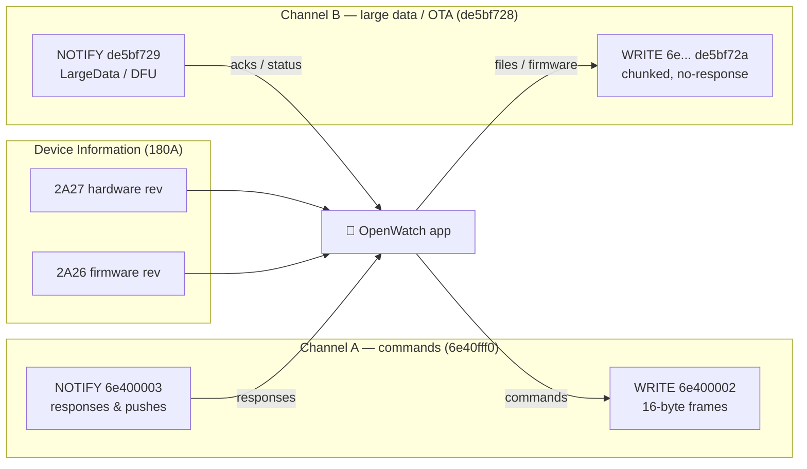
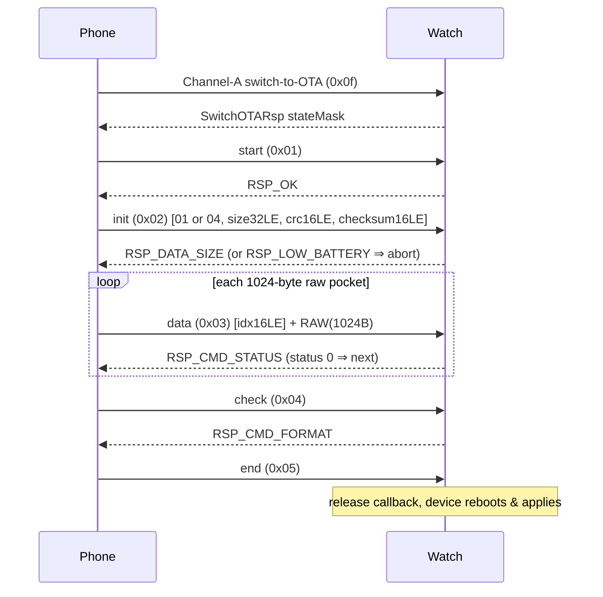

# QWatch Pro / Oudmon BLE Smartwatch — Reverse-Engineering Protocol Spec

> Canonical protocol reference for an open-source Flutter rewrite of `com.qcwireless.qcwatch`
> ("QWatch Pro"). Derived from static analysis of the shipped APK and cross-checked against H59MA
> firmware where noted. Where the source was ambiguous or a value could not be resolved statically,
> it is marked **TODO**. No opcodes are invented.

---

## 1. Overview

| Aspect | Value |
|---|---|
| User-facing app | **QWatch Pro** (`app_name`) |
| Android package | `com.qcwireless.qcwatch` |
| Vendor / OEM SDK | **Oudmon BLE SDK** (`com.oudmon.ble`) |
| Cloud vendor | QC Wireless (`com.qcwireless`) |
| Firebase project | `qwatchpro` (GCM sender `681190209674`) |
| Target SDK | Android 15 (SDK 35) |
| Device classes | Smart **rings** and **bracelets/watches** (same APK, capability-negotiated) |
| Audio/music stacks | Generic + **JieLi** (JL) SPP music streaming |
| OTA / DFU | **Oudmon-native DFU** over the large-data channel (Channel B). See note below. |

Firmware cross-reference: H59MA firmware r2 notes and address tables live in
[`firmwares/RE_FIRMWARE.md`](firmwares/RE_FIRMWARE.md). Firmware offsets there are `body.bin`
offsets unless noted; add `0x450` for the original `.bin` container offset.

**OTA / chip note.** Although the APK bundles a **Realtek** SDK (`com.realsil.sdk.*`), that code is the
**Bumblebee/bbpro audio-earbud** stack (ANC/APT/EQ/spatial-audio/local-playback) — **NOT** a watch DFU
service. **Watch firmware OTA is performed entirely by the Oudmon `DfuHandle` over Channel B**
(`de5bf728…`). The JieLi SPP code is music streaming, not file/OTA. Treat "Realtek = watch OTA" as
false.

**Transport.** All device communication is **BLE GATT**, over **two independent logical channels** on
the same connection (see §2). The cloud layer is a separate HTTPS/JSON + WebSocket API (see §6).

---

## 2. BLE Transport

### 2.1 GATT services & characteristics

| UUID | Role | Channel | Notes |
|---|---|---|---|
| `6e40fff0-b5a3-f393-e0a9-e50e24dcca9e` | **SERVICE** (command) | A | `UUID_SERVICE`. Vendor reused Nordic-UART `6e40*` base with `fff0` prefix. |
| `6e400002-b5a3-f393-e0a9-e50e24dcca9e` | WRITE | A | `UUID_WRITE`. Phone→watch 16-byte commands, `WRITE_TYPE_DEFAULT` (with response). |
| `6e400003-b5a3-f393-e0a9-e50e24dcca9e` | NOTIFY | A | `UUID_READ`. Watch→phone responses & pushes. CCCD enabled in `enableUUID()`. |
| `de5bf728-d711-4e47-af26-65e3012a5dc7` | **SERVICE** (large-data/file/OTA) | B | `SERIAL_PORT_SERVICE`. |
| `de5bf72a-d711-4e47-af26-65e3012a5dc7` | WRITE (no-response) | B | `SERIAL_PORT_CHARACTER_WRITE`. Chunked frames, `WRITE_TYPE_NO_RESPONSE`. |
| `de5bf729-d711-4e47-af26-65e3012a5dc7` | NOTIFY | B | `SERIAL_PORT_CHARACTER_NOTIFY`. Parsed by `LargeDataParser`/`DfuHandle`. |
| `00002902-0000-1000-8000-00805f9b34fb` | CCCD descriptor | A & B | `GATT_NOTIFY_CONFIG`. Written `ENABLE_NOTIFICATION_VALUE` on both notify chars. |
| `0000180A-…` | SERVICE Device Information | — | `SERVICE_DEVICE_INFO`. Read during handshake. |
| `00002A25-…` | READ Serial Number | — | DevInfo. |
| `00002A27-…` | READ Hardware Revision | — | `CHAR_HW_REVISION`. First handshake read. |
| `00002A26-…` | READ Firmware Revision | — | `CHAR_FIRMWARE_REVISION`. Second read (+200 ms); completion → `setReady(true)`. |
| `00002A23-…` | READ System ID | — | DevInfo. |
| `0000FEE7-…` | SERVICE Vendor "fee7" | — | Chinese-vendor profile. `fea1` write + CCCD, `fec9` read, `fea2` notify + CCCD, plus `2a00` Device Name. Static H59MA v14 routing shows its write callback reports generic Realtek service events and does not call the 16-byte opcode dispatcher; OpenWatch treats it as an optional probe/notify surface only. See `firmwares/_re/fee7-gatt/evidence.md`. |
| `00002A28-…` | — | — | **Phantom.** Bytes at v13 `0x20faf` / v14 `0x1f363` look like `0x2a28` but are a `0x2803` char-decl followed by value-UUID `0x2a00` (Device Name, inside the `0xFEE7` service). The firmware does **not** declare a SW Revision characteristic. |

H59MA firmware stores the BLE UUIDs as little-endian table data and confirms both logical channels
plus the vendor `0xFEE7` service. Body offsets below are for the relevant **UUID bytes** (the
preceding attribute-table offset in `RE_FIRMWARE.md` differs by a few bytes — see
`firmwares/R2_ANALYSIS.md` §7 for the corrected table). `firmwares/FIRMWARE_ANALYSIS.md`
§3 documents the underlying Realtek-style attribute record layout.

| UUID | v13 body offset | v14 body offset |
|---|---:|---:|
| Device Info service | `0x20c78` | `0x1f02c` |
| Serial Number `2a25` | `0x20cae` | `0x1f062` |
| HW revision `2a27` | `0x20ce6` | `0x1f09a` |
| FW revision `2a26` | `0x20d1e` | `0x1f0d2` |
| System ID `2a23` | `0x20d56` | `0x1f10a` |
| Channel B service `de5bf728` | `0x20d7c` | `0x1f130` |
| Channel B write `de5bf72a` | `0x20dc6` | `0x1f17a` |
| Channel B notify `de5bf729` | `0x20dfe` | `0x1f1b2` |
| Channel A service `6e40fff0` | `0x20e40` | `0x1f1f4` |
| Channel A write `6e400002` | `0x20e8a` | `0x1f23e` |
| Channel A notify `6e400003` | `0x20ec2` | `0x1f276` |
| Vendor `0xFEE7` service | `0x20f08` | `0x1f2bc` |
| Vendor `fea1` write | `0x20f3e` | `0x1f2f2` |
| Vendor `fec9` read | `0x20f92` | `0x1f346` |
| Vendor `fea2` notify | `0x20fca` | `0x1f37e` |
| Device Name `2a00` | `0x20fb0` | `0x1f364` |



### 2.2 MTU

- **Channel A** does **no** MTU negotiation. `onMtuChanged` is a bare super-call. Incoming notifies
  **must** be exactly 16 bytes (`CMD_DATA_LENGTH=0x10`) or they are dropped.
- **Channel B** chunk size = `JPackageManager.getLength()`, default **`0x14` = 20 bytes**
  (classic ATT MTU 23 − 3). Negotiable upward via the device's **PackageLength** notify (opcode
  `0x2f`), floored at `0x14`: `setLength(max(devValue, 0x14))`.

### 2.3 Connection & handshake sequence

```mermaid
sequenceDiagram
    participant P as Phone
    participant W as Watch

    P->>W: GATT connect
    W-->>P: connected
    P->>W: discoverServices()
    P->>W: write CCCD ENABLE on 6e400003 (Channel-A notify)
    Note over P: 4s watchdog armed; FW-timeout at +500/1500/2500 ms
    P->>W: ReadRequest(180A, 2A27)
    W-->>P: hardware revision
    P->>W: +200 ms ReadRequest(180A, 2A26)
    W-->>P: firmware revision
    Note over P,W: setReady(true) — Channel-A WRITES now allowed<br/>(reads were never gated)
    rect rgb(235,245,255)
    note right of P: App layer (after ready)
    P->>W: bind (0x10)
    P->>W: SetTime (0x01)
    W-->>P: SetTimeRsp = capability manifest
    P->>W: DeviceSupportReq (0x3c)
    W-->>P: support bitmap
    end
```

Until `ready == true`, Channel-A **writes** are rejected (`"init not complete"`);
Device-Info **reads** are not gated.

The SDK transport itself sends **no** automatic bind/SetTime; those are app-level commands issued once
`ready`.

### 2.4 Write queue

- Single serialized queue: `BleOperateManager.execute` → runnable on a `HandlerThread`.
- Each GATT op blocks on a `waitUntilActionResponse`/`notifyLock` handshake — **one** GATT operation
  at a time, **5000 ms** timeout.
- Every GATT callback (write / read / notify-config / notify) calls `notifyLock()` to release the next
  queued op.

---

## 3. Packet Framing

### 3.1 Channel A — command channel (fixed 16-byte frames)

```
 byte:  0        1                              14       15
       +--------+------------------------------+--------+
       | opcode |  subData payload (zero-pad)  |  CRC8  |
       +--------+------------------------------+--------+
        ^                                       ^
        key/Constants.CMD_*                     sum(bytes[0..14]) & 0xFF
        (RX: high bit 0x80 = ERROR flag,        (additive 8-bit checksum,
         masked off to get base opcode)          NOT CRC16)
```

- **Always** 16 bytes. No fragmentation on this channel — long data must use Channel B.
- **Channel-A framing is built phone-side, but dispatch is implemented on both sides.** The Oudmon
  SDK builds frames, computes the additive CRC8, and dispatches responses on the phone. The H59MA
  v14 firmware also contains a real dispatcher at `channel_a_dispatch_queued_frame`
  (`0x0082d2dc`) that reads the opcode from a queued 16-byte frame and calls per-opcode handlers
  (see `firmwares/GHIDRA_DECOMPILATION.md`
  §3). The v13 bucket table at `0x22490` remains unreferenced dead code; the v14 dispatcher uses a
  direct switch/case instead. **v13 ↔ v14 are wire-compatible** — v14 is a debug-log strip +
  dead-table cleanup, no protocol change.
- TX build (`BaseReqCmd.getData`): `buf=new byte[16]; buf[0]=key; arraycopy(getSubData,0,buf,1,len); addCRC(buf)`.
- RX dispatch (`QCBluetoothCallbackReceiver.onCharacteristicChange` on `6e400003`):
  1. len **must** == 16 else dropped.
  2. `checkCrc` must pass else dropped.
  3. `opcodeKey = data[0] & ~0x80` (strip `FLAG_MASK_ERROR`; the top bit signals device-side error).
  4. Try `parserAndDispatchReqData`: look up per-request `LocalWriteRequest` in
     `localWriteRequestConcurrentHashMap[opcodeKey]` (registered by `executeReqCmd` when an
     `ICommandResponse` callback was supplied). Build/accumulate `Rsp` via
     `BeanFactory.createBean(opcodeKey, type)`, `acceptData(payload)`.
  5. Else fall back to `parserAndDispatchNotifyData(notifySparseArray, data)` — the persistent
     listener registry (pre-registered: `0x1d` Music, `0x02` InnerCamera, `0x2f` PackageLength,
     `0x73` DeviceNotify, `0x78` DeviceSportNotify; plus dynamic `addNotifyListener` etc.).
- **RX payload** to `Rsp.acceptData` = `bytes[1..14]` (opcode + CRC stripped), so `payload[0]` == frame
  `byte[1]` == first subData byte.
- **Multi-packet accumulation** (`tempRspDataSparseArray[opcodeKey]`): `acceptData()` boolean is
  **inverted** — **`true` = need more packets**, **`false` = complete** (fire `onDataResponse`, delete temp entry).

#### Mixture sub-command convention (read/write/delete)

For settings that are readable & writable (`MixtureReq` subclasses), **`subData[0]` is a sub-opcode**:

| subData[0] | Meaning |
|---|---|
| `0x01` | READ (query current value) — `getReadInstance()` |
| `0x02` | WRITE (set value) — `getWriteInstance(...)` |
| `0x03` | DELETE / clear — `getDeleteInstance()` |

Boolean encoding gotchas:
- Most writes: **`1` = on, `2` = off** (NOT 1/0).
- A few invert via XOR-1 so the wire byte is the logical-NOT (`0=on,1=off`): **TimeFormat is24/metric**,
  **MusicSwitch playing**.
- Some health settings use raw `0/1` int-to-byte (BloodOxygen/Pressure/UV).

### 3.2 Channel B — large-data / file / OTA (length-prefixed + CRC16)

```
 byte:  0      1     2    3     4    5     6 ...
       +------+-----+----------+----------+-----------+
       | 0xBC | cmd | len (LE) | CRC16(LE)|  payload  |
       +------+-----+----------+----------+-----------+
        magic       u16 little  u16 little
                    -endian     -endian, over PAYLOAD ONLY
```

- `byte[0]` = `0xBC` magic (the `-0x44` in smali).
- `byte[1]` = cmd / action id.
- `byte[2..3]` = payload length, **uint16 LE** (`DataTransferUtils.shortToBytes`).
- `byte[4..5]` = **CRC16 of payload only** (`CRC16.calcCrc16`), uint16 LE.
- `byte[6..]` = payload.
- **Empty payload** ⇒ `bytes[2..5]` = `FF FF FF FF` (sentinel; len/crc omitted).
- H59MA caps declared payload length at `0x504` bytes (`0x50c` reassembly state buffer minus the
  8-byte header/accumulator block); OpenWatch mirrors that cap for incoming watch→host frames.
- Whole frame wrapped in `BleDataBean(data, subLength)` → `BleThreadManager` → `BleConsumer` slices into
  `subLength`-byte no-response writes to `de5bf72a`. `subLength` = `JPackageManager` length (default 20).
- RX (`onReceivedData` on `de5bf729`): `byte[0]` must == `0xBC`; `byte[1]` = cmd; first packet
  `byte[2..3]` = total count/size; routed via `LargeDataHandler.respMap` keyed by cmd id.

### 3.3 CRC summary (per-channel — they differ!)

| Channel | Algorithm | Scope |
|---|---|---|
| A | additive 8-bit sum `& 0xFF` | bytes `[0..14]` |
| B | CRC-16/MODBUS (`poly=0xA001`, init `0xFFFF`) | **payload only** (not header) |

Firmware evidence for Channel B: r2 disassembly of H59MA v13 at body `0x8c54..0x8c9c` and v14 at
`0x8c0c..0x8c54` checks `len >= 6`, compares byte 0 with `0xBC`, reads `len16LE` from bytes 2/3,
reads `crc16LE` from bytes 4/5, and copies payload from byte 6. The CRC helpers at v13
`0x8d5c..0x8d9a` and v14 `0x8d14..0x8d52` use init `0xFFFF` and lookup tables at v13 `0x2100c` and
v14 `0x1f3c0`, whose first words match the canonical reflected `0xA001` table.
OpenWatch's host decoder is stricter than the firmware receiver for watch→host frames: if a
received Channel-B frame contains bytes beyond the declared payload length, it is treated as
malformed instead of truncating the extra bytes into a seemingly valid event.

Firmware evidence for Channel-A buckets: v13 body `0x22490` is a one-byte-per-opcode bucket table
matching the APK-derived command families: `0x01..0x09` and `0x0f..0x20` plain request bucket `0x40`,
`0x0a..0x0e` mixture bucket `0x41`, `0x22..0x30` notify/push bucket `0x02`, `0x42..0x47` bucket
`0x90`, `0x48..0x5b` bucket `0x10`, `0x62..0x67` bucket `0x88`, and `0x68..0x7b` bucket `0x08`.
The same contiguous table was not found in v14, but its command literal table moved from v13
`0x21b58` to v14 `0x1ff0c`.

### 3.4 Endianness cheat-sheet (the #1 gotcha — three helpers!)

| Helper | Endianness | Used by |
|---|---|---|
| `DataParseUtils.intToByteArray` | **LE** 4B | `ReadBandSportReq`, weather timestamp |
| `DataParseUtils.byteArrayToInt` | **BE** | `ReadSportRsp` field decode |
| `BLEDataFormatUtils.bytes2Int` | **BE** | TotalSport/TodaySport/ReadDetailSport (callers re-order arrays) |
| `ByteUtil.bytesToInt` | **LE** | AppSport/AppGps timestamp, TargetSetting fields, Channel-B sleep |
| `ByteUtil.intToByte` | **LE** | `PhoneGpsReq` distance/calorie |
| `DataTransferUtils.intToBytes/shortToBytes` | **LE** | Target write (low 3 bytes → 24-bit LE), Channel-B headers |

BCD: hours/minutes/days/months/year-offset use `BLEDataFormatUtils.decimalToBCD` / `BCDToDecimal`.
Year = `BCD(byte) + 2000` (`0x7d0`).

---

## 4. Command Reference

> Offsets in **Response** columns are **payload-relative** (`payload[0]` = frame `byte[1]`).
> `acceptData` returns `true`=need-more / `false`=done.

### 4.1 Transport primitives

| Name | Opcode | Sub | Dir | Request | Response | Meaning |
|---|---|---|---|---|---|---|
| WriteRequest | n/a | — | →watch | 16B `[op][subData][crc8]` to `6e400002` | 16B notify on `6e400003` by opcode | Channel-A command write. `WRITE_TYPE_DEFAULT(2)`, or `NO_RESPONSE(1)` when noRsp. |
| LocalWriteRequest | n/a | — | →watch | same 16B frame | `BeanFactory.createBean(op,type).acceptData(bytes[1..14])` | WriteRequest + `ICommandResponse` waiter + type; correlates response by opcode. |
| ReadRequest | n/a | — | ->watch | `readCharacteristic(180A, 2A27/2A26)` plus optional DevInfo reads (`2A25`/`2A23`) | raw ASCII / binary DevInfo values | Device-Info reads during handshake only. `2A28` is a field-seam phantom on H59MA, not a real SW Revision characteristic. |
| EnableNotifyRequest | n/a | — | →watch | CCCD(`00002902`)=ENABLE; `writeDescriptor` | `onDescriptorWrite → enable(bool)` | Enable notify on `6e400003` and `de5bf729`. |
| Large-data write | `0xBC` | cmd@[1] | →watch | `[BC][cmd][len16LE][crc16LE][payload]`; empty⇒`FF FF FF FF` | inbound on `de5bf729`, routed by cmd id | Channel-B framed write, sliced into `subLength` chunks. |

### 4.2 Device & display (Channel A)

| Name | Opcode | Sub | Dir | Request | Response | Meaning |
|---|---|---|---|---|---|---|
| SetTimeReq | `0x01` | — | →watch | `[BCD y,mo,d,h,mi,s][lang][tzHalfHour+1]` (8B; tz=`((off+24)%24)*2+1`) | **SetTimeRsp** = 14B capability bitmap (see §4.2.1) | Set clock; reply doubles as device capability manifest (screen w/h, max faces/contacts). |
| DeviceSupportReq | `0x3c` | — | →watch | empty subData | **DeviceSupportFunctionRsp** bitmap (see §4.2.2) | Feature-support probe; usually first after ready. |
| DeviceThemeReq | `0x3d` | 01/02 | →watch | r:`[01]` w:`[02,theme]` | DeviceThemeRsp: `pl[1]`=type; type==1⇒`pl[2..]`=UTF name | Get/set UI theme id. |
| DeviceWallpaperReq | `0x3f` | 01/02 | →watch | r:`[01]` w:`[02,value]` | DeviceWallpaperRsp: `pl[1]`=type; type==1⇒`pl[2..]`=UTF name | Get/set wallpaper. |
| DeviceAvatarReq | `0x32` | — | →watch | empty subData | `pl[0]`=screenType; `pl[1..2]`=avatarWidth LE; `pl[3..4]`=height LE | On-device avatar canvas geometry. |
| DisplayClockReq | `0x12` | 01/02 | →watch | w:`[02, en?1:2]` | state echo `pl[1]` (1/2) | Always-on/display clock. |
| WatchfaceDisplayClockReq | `0x18` | style | both | `[style, length, label…]` | echo `[style, length, echoedLength, label…]` per GHIDRA §3.5 | Watch-face / clock-display label and BLE-name refresh path. Distinct from `0x12` always-on display-clock toggle. |
| DisplayOrientationReq | `0x29` | 01/02 | →watch | w:`[02, p1?1:2, (p1?0:(p2?1:2))]` | status | Screen orientation/auto-rotate. |
| DisplayStyleReq | `0x2a` | 01/02 | →watch | w:`[02, style]` | status | Display style id. |
| DisplayTimeReq | `0x1f` | 01/02/03 | →watch | w:`[02, displayTime, displayType, alpha, 0x00, total, curr]` (idx4 reserved) | status | Screen-on duration/brightness profile (read/write/delete). |
| BrightnessSettingsReq | `0x1b` | 01/02 | →watch | w:`[02, level]` | status | Screen brightness. |
| DegreeSwitchReq | `0x19` | 01/02 | →watch | w:`[02, en?1:2, isCelsius?1:2]` | status | Temperature unit/degree display. |
| TimeFormatReq | `0x0a` | 01/02 | →watch | w:`[02, is24^1, lang]` (+profile variants, see note) | status | 12/24h + optional user profile/health baselines. is24 (& metric in $3) XOR-1 inverted. |
| DndReq | `0x06` | 01/02 | →watch | w:`[02, en?1:2, sH, sM, eH, eM]` | status | Do-Not-Disturb schedule. |
| PalmScreenReq | `0x05` | 01/02 | →watch | w:`[02, p1?1:2, (p2?1:2)|(p3?4:0)]` (p3 always true in factory) | status | Palm/cover gesture. |
| IntellReq | `0x09` | 01/02 | →watch | w:`[02, en?1:2, delaySecond]` | status | Smart-feature toggle + delay. |
| TouchControlReq | `0x3b` | multiplexed | →watch | read:`[01, on?0:1]`; readTouch:`[01,02]`; tpSleep:`[02,02,a,b]`; write:`[02,(p2?00:01),p1,p4/p3]` | status | Touch/TP-sleep control. `subData[1]`=sub-key. |
| FindDeviceReq | `0x50` | — | →watch | `[0x55, 0xAA]` magic | FindPhoneRsp/status | Make the watch ring/vibrate. |
| CameraReq | `0x02` | action | →watch | `[action]` (4=enter UI, 5=keep-screen-on, 6=finish; ctor throws if <4/>6) | **CameraNotifyRsp** (watch→phone shutter) | Remote-camera control. ⚠ opcode `0x02` collides with InnerCamera notify key. |
| SimpleKeyReq | caller-supplied | — | →watch | `[op]` only (subData null). Seen: `0x03`, `0x08` | status | Generic opcode-only trigger. Base of RestoreKeyReq. |
| RestoreKeyReq | caller-supplied | — | →watch | `[0x66, 0x66]` confirm magic | status | Factory reset / restore defaults. |

**TimeFormat profile variants** (all `subData[0]=0x02`):
`$1`(10B): `[02,is24^1,metric,sex,age,height,weight,sbp,dbp,rateWarn]`.
`$2`(11B): `…+open`.
`$3`(11B): `[02,is24^1,metric^1,sex,age,height,weight,sbp,dbp,rateWarn,open]` (metric also XOR-1).

#### 4.2.1 SetTimeRsp 14-byte capability bitmap (payload-relative)

| Byte | Bits → flags |
|---|---|
| `pl[0]` | `==1` ⇒ mSupportTemperature |
| `pl[1]` | b0 Plate, b1 BloodSugarCheck, b2 Stock, b3 AppInstall, b4 Quick, b5 DeviceLayout, b6 Heart, b7 Sleep |
| `pl[2]` | b0 Menstruation |
| `pl[3]` | b0 CustomWallpaper, b1 BloodOxygen, b2 BloodPressure, b3 Feature, b4 OneKeyCheck, b5 Weather, b6 WeChat(**inverted** 0⇒true), b7 Avatar |
| `pl[4..5]` | width (LE int) |
| `pl[6..7]` | height (LE int) |
| `pl[8]` | `==1` ⇒ NewSleepProtocol |
| `pl[9]` | mMaxWatchFace |
| `pl[0xa]` | b0 Contact, b1 Lyrics, b2 Album, b3 GPS, b4 JieLiMusic, b5 AppMeasure |
| `pl[0xb]` | b0 ManualHeart, b1 ECard, b2 Location, b4 MusicSupport, b5 rtkMcu, b6 EbookSupport, b7 BloodSugar |
| `pl[0xc]` | contacts: 0⇒maxContacts=20 else value*8 |
| `pl[0xd]` | b0 Record, b1 bpSetting, b2 4G, b3 NavPicture, b4 Stress/Pressure, b5 HRV, b6 BloodLipids, b7 UricAcid |

#### 4.2.2 DeviceSupportFunctionRsp bitmap (payload-relative)

Most APK-era devices return the bitmap below. H59MA firmware is a special case:
the same Channel-A `0x3c` opcode falls through to the FEE7 capability handler
(`FUN_0082c50e`) and returns a fixed product capability block instead of this
bitmap. Live H59MA_V1.0 v13 capture:
`3c 00 40 00 80 00 00 00 20 00 00 00 00 00 00 1c`; v14 RE notes show the
same opaque feature-ID shape with IDs at bytes 2/7/11. Treat those fixed blocks
as the H59MA app-level feature set (HR, SpO2, pressure/BP, new sleep), not as
the generic bitmap below.

| Byte | Bits → flags |
|---|---|
| `pl[1]` | b0 Touch, b1 Moslin, b2 APPRevision, b3 BlePair, b4 WatchTheme, b6 deviceNoScreen |
| `pl[3]` | b7 AiAnalyze |
| `pl[4]` | b0 MenuWallpaper, b2 WechatPay |
| `pl[5]` | b7 Moslin(overwrite), onlyTouch |
| `pl[6]` | b2 notSupportTakePhoto, b3 LoverSpace, b4 Worship, b5 NewPraise, b6 Alarm, b7 DoNotDisturb |
| `pl[7]` | b0 Ultraviolet, b3 RealTimeHr, b4 RealTimeHrRemind, b5 Friends |
| `pl[8]` | b0 NoScreen24Hour, b1 NoScreenDrinkRemind, b2 NoScreenBrightScreenTime, b3 ReduceFat, b4 hideMessageNotification |
| `pl[0xa]` | b1 ⇒ Temperature200 |

### 4.3 Health sensors (Channel A)

| Name | Opcode | Sub | Dir | Request | Response | Meaning |
|---|---|---|---|---|---|---|
| ReadHeartRateReq | `0x15` | — | →watch | `[1..4]`=local-day epoch seconds u32 LE (use local midnight for per-day reads; `0x00000000` asks for latest/current) | **ReadHeartRateRsp** multi-pkt per `FUN_0082cf48` (GHIDRA §3.12): hdr `pl[0]=0x18` (legacy) or `pl[0]=0x00,pl[1]=totalFrames` (H59MAX); data `pl[0]=seq(1..23)`, `pl[1..14]=13B` containing the echoed u32 LE (bytes 0..3 of the reassembled record) + 9 BPM bytes; `pl[0]=0xFF`=empty day. stride 13B. | Read stored HR history. Up to 288 5-min slots/day. The watch RTC is set from local BCD bytes, so per-day lookups must use the host-local midnight epoch, not a UTC reconstruction. Note: 0x15 has NO inner `0x01` tag byte — that scheme is for 0x0d/0x37/0x39/0x7d. |
| HeartRateSettingReq | `0x16` | 01/02 | →watch | w2:`[02,en?1:2,interval]`; w5:`+[startInterval,tooLow,tooHigh]` | read: `[1]`en, `[2]`interval, `[3]`startInterval, `[4]`tooLow, `[5]`tooHigh | HR auto-measure config + hi/lo alarms. |
| RealTimeHeartRate | `0x1e` | — | →watch | `[action]` where `01`=start 60 s, `02`=stop, `03`=reset/extend | no direct ack on H59MA; live HR arrives on notify paths | Toggle realtime HR stream. |
| StartHeartRateReq | `0x69` | type | →watch | `[type, sub]` (type enum below) | `[0]`type `[1]`errCode `[2]`value; if len≥5 `[3]`sbp `[4]`dbp | Start a measurement session. |
| StopHeartRateReq | `0x6a` | type | →watch | `[type, p2, p3]` (factories per type) | `[0]`type `[1]`err `[2]`value; len≥5 `[3]`sbp `[4]`dbp | Stop a measurement. (per-request waiter) |
| ReadPressureReq | `0x14` | — | →watch | `[1..4]`utcStart i32 LE `[5]=00` `[6]=0x32` | **ReadBlePressureRsp**: `[0..3]`ts i32 LE (`0xFFFFFFFF`=end), `[4]`val, `[5]`val2 → BlePressure. ≤50 records. | Read BLE-pressure measured values. |
| BloodOxygenSettingReq | `0x2c` | 01/02 | →watch | w:`[02, en(0/1)]` | read: `[1]`enable | SpO2 auto-measure on/off. |
| BpSettingReq | `0x0c` | 01/02 | →watch | r:`[01]`; w:`[02,en,sH,sM,eH,eM,intervalMinutes]` where interval is nonzero and divisible by 30 | read response is 7 bytes: `[0]=01,[1]`en,`[2]`startH,`[3]`startM,`[4]`endH,`[5]`endM,`[6]`intervalMinutes`; invalid writes ACK as `opcode|0x80` | BP auto-measure window. H59MA v14 defaults to enabled, `00:00..23:00`, interval `0x3c` (hourly). Other sub-values have no response. |
| BpReadConformReq | `0x0e` | — | →watch | `[0x00]`=advance/read next; nonzero silently exits | response is BP history via `0x0d` | Advance the BP record cursor and emit the next compact history record. |
| BpDataRsp (no req) | `0x0d` | — | watch→ | n/a | hdr `[0]=00`{`[1]`yr-2000,`[2]`mo,`[3]`d,`[4]`intervalMinutes,`[5..10]`48-bit presence bitmap,`[11..13]=0`}; data frames `[0]=01` + up to 13 compact one-byte BP values in ascending set-bit order; `[0]=FF`=empty/end | BP history records. H59MA v14 initializes `intervalMinutes=0x3c` (hourly) and stores 24 4-byte persistent slots, but the `0x0d` stream emits only the first byte of each valid slot. OpenWatch preserves those compact bytes; systolic/diastolic reconstruction remains capture work. |
| HRVReq | `0x39` | index | →watch | `[index]` | multi-pkt (`[0]=00`{size,range=30}, `[0]=01`{offset days-back + samples}, `0xFF`=end). stride 13B. | Read HRV history for a day index. |
| PressureReq | `0x37` | index | →watch | `[index]` | multi-pkt (same scheme as HRV). stride 13B. | Read stress history for a day index. |
| PressureSettingReq | `0x38` | 01/02 | →watch | w:`[02,en(0/1)]` | read: `[1]`enable; response echoes `[0x38,sub,value]` | Stress/pressure auto-measure enable bit. H59MA v14 has no confirmed Channel-A HRV auto-measure setting; the old APK-era `0x38` HRV setting row is stale for this firmware. |
| UltraVioletReq | `0x7d` | index | →watch | `[index]` | multi-pkt (same scheme). stride 13B. | Read UV-index history for a day index. |
| UVSettingReq | `0x3e` | 01/02 | →watch | w:`[02,en(0/1)]` | read: `[1]`enable | UV auto-measure on/off. |
| SugarLipidsSettingReq | `0x3a` | type+act | →watch | r:`[type,01]`; w:`[type,02,en(0/1),valLo,valHi]` | `[1]`act, if read `[0]`type,`[2]`en,`[3..4]`value LE,`[5]`supportUnit | Blood sugar/lipids reference config. (per-request waiter) |
| MenstruationReq | `0x2b` | 01/02 | →watch | w(11B):`[02,p1,p2,p3,p4,p5,p6,p7,p8,p9,p10]` | **MenstruationDataRsp** 16B (per GHIDRA §3.1/§3.1.1, `FUN_0082b078` lazy-init + `FUN_0082af28` read-memcpy): `[0]`sentinel (`0xCA`=present; lazy-init zeroes; quirk — `rsp[0]` is overwritten with `start_date_bcd[0]` on read, so host must re-stamp `rsp[0]=0x2B`), `[1]`startDate-yr BCD, `[2]`cycleLenDays BCD, `[3]`startDate-day BCD, `[4..5]`=`currentDay − record[4]` (u16 LE on write, low byte only returned), `[6..7]`=`currentMonth − record[6]` (u16 LE on write, low byte only returned), `[8..12]`=5B opaque `periodData` (semantics not RE-resolvable), `[13..15]`=padding (always zero on write/read-back). Decode via `MixtureState.tryParse`. | Menstrual-cycle config. |
| HealthEcgRsp (notify) | **needs live capture** | — | watch→ | n/a (session under `0x69` type=7) | Statically unresolvable in H59MA v14 — §10.2 unified inventory (GHIDRA §10.2 lines 6322–6396) enumerates every vendor/high opcode statically resolved and none match the `[status,ecgInterval,ppgInterval]` shape. §8.5 per-mode start dispatch (lines 5228–5236) has no mode-0x07 (ECG) entry — falls into HR-mode-1 fallback (`health_post_start_measure_event(1)`). Do not infer a payload layout from §8.5 fallback semantics. | ECG status during ECG session. Listener opcode not statically resolvable. |
| PpgDataRspCmd (notify) | **needs live capture** | — | watch→ | n/a (ECG/PPG session) | Statically unresolvable in H59MA v14 — the only PPG-related handler is §3.10 `0x2c` SpO2 (an enable-bit + auto-measure cadence), NOT a real-time stream from a `0x69` type=7 session. Do not infer a payload layout. | Raw PPG + HR stream. Listener opcode unresolved. |

**StartHeartRate type enum:** HEARTRATE=1, BLOODPRESSURE=2, BLOODOXYGEN=3, FATIGUE=4, HEALTHCHECK=5,
REALTIMEHEARTRATE=6, ECG=7, PRESSURE=8, BLOOD_SUGAR=9, HRV=0xa, BODY_TEMPERATURE=0xb.
**Action enum:** START=1, PAUSE=2, CONTINUE=3, STOP=4.

### 4.4 Activity / sport / sleep / alarm / target

| Name | Opcode | Sub | Dir | Request | Response | Meaning |
|---|---|---|---|---|---|---|
| ReadBandSportReq | `0x13` | — | →watch | `[1..4]`ts u32 LE | **ReadSportRsp** multi-pkt: hdr `b0=00,b1=size`(*13); records 13B; 7×4B **BE** fields [startTime,duration,sportType,stepCount,distance,calories,hrCount] + hrCount HR bytes; `0xFF`=end | Read one stored exercise session. |
| ReadDetailSportDataReq | `0x43` | `0x0F`@[1] | →watch | `[dayOffset,0F,startSeg,endSeg(≤0x5f),01]` | paged BleStepDetails: `0xFF`=clear, `0xF0`=init(`b2==1`⇒calorie*10); data `[0]`yr-2000,`[1]`mo,`[2]`d,`[3]`segIdx, cal/steps/dist=`bytes2Int` of swapped pairs; `b4`=page,`b5`=total; done when `b4==b5-1` | Per-slot step detail for a day. |
| ReadTotalSportDataReq | `0x07` | — | →watch | `[dayOffset]` | **NOT IMPLEMENTED in H59MA v14.** The §10.2 Channel-A inventory (GHIDRA §10.2 lines 6345–6373) enumerates 22 handlers (`0x01, 0x06, 0x08, 0x0e, 0x15, 0x18, 0x1e, 0x25, 0x26, 0x2b, 0x2c, 0x37, 0x38, 0x39, 0x3a, 0x3b, 0x43, 0x72, 0x77, 0x7a, 0xa1, 0xc6, 0xc7, 0xff`); `0x07` is absent. The only `0x07` handler in the firmware is the Channel-B OTA `ota_cmd_sub_ack` table slot. The closest live data the firmware exposes is `0x48` todaySport (15B interleaved totals), `0x43` readDetailSport (292B per-day dump), and Channel-B `0x2a` activity summary (49B per-day record). The OpenWatch host code defines `OpA.readTotalSport = 0x07` (`lib/core/protocol/opcodes.dart:69`) but the request is never called; no decoder exists. Treat the `TotalSportDataRsp` entry as a legacy/SDK-era spec that v14 retired (subsumed by `0x48`/`0x2a`). | Stale/legacy. |
| PhoneSportReq | `0x77` | — | →watch | `[status, sportType]` | **AppSportRsp**: `b0`=gpsStatus; if==6 `ts=bytesToInt(b[2..6])` u32 LE | Tell watch the phone's app-side sport status. |
| PhoneGpsReq | `0x74` | — | →watch | gps:`[status,00]`; phoneData:`[05,00]+dist u32 LE+cal u32 LE` | **AppGpsRsp**: same shape as AppSport | GPS/outdoor-sport coordination. |
| ReadSleepDetailsReq | `0x44` | `0x0F`@[1] | →watch | `[dayOffset,0F,startSeg,endSeg(≤0x5f)]` | paged BleSleepDetails: `0xFF`=clear, `0xF0`=init; data `[0]`yr-2000,`[1]`mo,`[2]`d,`[3]`idx, `sleepQualities[8]=b[5+i]`; `b4`/`b5` page/total | Legacy per-slot sleep detail. |
| H59MA sleep summary | `0x11` (Ch B) | — | →watch | `[dayOffset]` | `0x11` payload `[dayOffset][100 B summary]` | Firmware-confirmed H59MA v14 sleep summary. No clamp seen. |
| H59MA sleep detail | `0x12` (Ch B) | — | →watch | `[dayOffset]` | `0x12` payload `[dayOffset][288 B detail]`; no-data/error returns compact NAK for cmd `0x12` with status=`dayOffset` | Firmware-confirmed H59MA v14 detail; today overlays current hourly slot before send. |
| SetAlarmReq | `0x23` | — | →watch | `[idx(0..4),en(0..2),hourBCD,minBCD, day0..day6]` (11B; 7 weekday flags from weekMask bits) | SimpleStatusRsp ack | Set clock alarm slot. |
| ReadAlarmReq | `0x24` | — | →watch | `[idx(0..4)]` | **ReadAlarmRsp**: `weekMask=Σ(b[4+i]<<i)`; AlarmEntity(idx,en,BCD h/m,weekMask) | Read clock alarm slot. |
| SetDrinkAlarmReq | `0x27` | — | →watch | same 11B layout as SetAlarm, idx 0..7 | ack | Drink/sedentary reminder slot. ⚠ Channel-B sleep also uses cmd `0x27`. |
| ReadDrinkAlarmReq | `0x28` | — | →watch | `[idx(0..7)]` | ReadAlarmRsp (same as `0x24`) | Read drink/sedentary slot. |
| SetSitLongReq | `0x25` | — | →watch | `[sH,sM,eH,eM (BCD), weekMask, cycle]` cycle∈{30,60,90}s else 30 | ack | Sedentary reminder window. |
| ReadSitLong | `0x26` | — | →watch | bare opcode read | **ReadSitLongRsp**: BCD window, `b4`=weekMask, `b5`=cycle | Read sedentary config. |
| TargetSettingReq (read) | `0x21` | `0x01` | →watch | `[01]` | **TargetSettingRsp** `readSubData`: step `b[1..4]`(3B LE), calorie `b[4..7]`, distance `b[7..10]`, sport `b[10..12]`(2B), sleep `b[12..14]`(2B) | Read daily goals. |
| TargetSettingReq (write s/c/d) | `0x21` | `0x02` | →watch | `[02]+step LE24+cal LE24+dist LE24` (10B) | echo via TargetSettingRsp | Write step/cal/dist goals. |
| TargetSettingReq (write +sport/sleep) | `0x21` | `0x02` | →watch | `…+sportMin u16 LE+sleepMin u16 LE` (14B) | echo | Extended goal write. |
| TodaySportData | `0x48` | — | watch→ | (read) bare opcode | **TodaySportDataRsp**: 3B **BE** groups — totalSteps `b[0..2]`, running `b[3..5]`, calorie `b[6..8]`, walkDist `b[9..11]`, sportDur `b[12..13]`(2B) | Today's running step total. |
| SleepNewProtoResp (night) | `0x27` (Ch B) | — | watch→ | H59MA live shape: `[recordCount, {dayDelta, blockLen, startMinLE, endMinLE, (type,durMin)*}...]`; older captures may use `[dayOffset, endMinBE, (type,durMin)*]` | `blockLen` includes the 4 start/end bytes plus pair bytes; pair durations sum to `end-start` modulo midnight | Night sleep (new protocol). |
| SleepNewProtoReq/Resp (night+lunch) | `0x27` request, `0x27`/`0x3e` responses (Ch B) | — | both | request `[maxDayOffset, recordType?]`; maxDayOffset clamps to `6`; missing recordType defaults `0` | `recordType==1` first emits `0x3e` nap/lunch records, then firmware always emits `0x27` night records. Both are count-prefixed record lists. | H59MA v14 new sleep records. |
| Activity summary | `0x2a` (Ch B) | — | both | request `[maxDayOffset]`, clamped to `2` | response is repeated 49-byte entries `[dayOffset][48 B activity body]`, max 3 entries (`2,1,0`) | Do not treat `dayOffset=0` as terminator; use Channel-B payload length. |
| AppSport (notify) | `0x77` | — | watch→ | n/a | `b0`=gpsStatus; if==6 ts=`bytesToInt(b[2..6])` LE | Watch requests phone GPS-sport sync. |
| AppGps (notify) | `0x74` | — | watch→ | n/a | same as AppSport | Watch GPS sync notify. |

### 4.5 Notifications / weather / Muslim (Channel A)

| Name | Opcode | Sub | Dir | Request | Response | Meaning |
|---|---|---|---|---|---|---|
| BindAncsReq | `0x04` | `0x02` | →watch | Channel-A frame `[02, verBucket, UTF-8 MODEL≤12B]` (APK uses `verBucket`: 0x0a SDK29/30, 0x09 SDK28, 0x08 SDK26/27, else 0). Firmware stores a 12-byte model slot from request offset 3. Earlier docs called this FEE7-native, but radare2 now shows the FEE7 write callback does not reach the 16-byte dispatcher. | one-byte ACK `[0x04]` | Register phone identity for ANCS attribute parsing. OpenWatch sends this over Channel A. |
| SetANCSReq | `0x60` | — | →watch | `[FF,9F,FF,FF]` | **ReadANCSRsp**: `pl[0..1]`=stateMask u16 LE | Subscribe ANCS categories (near-all). |
| SetMessagePushReq | `0x61` | — | →watch | empty | **ReadMessagePushRsp**: deviceSupport1/2/3 = ints @off 2/4/6 | Query message-push capability. |
| PushMsgUintReq | `0x72` | — | →watch | `[type, argB, argC, content…]` | **PhoneNotifyRsp** (push): `action=pl[0]&0xff`; isReject ⇔ action==1 | Push a notification to watch. |
| BlackListReq | `0x2d` | — | →watch | `[0x01]` | (none) | Contact black-list enable/read. |
| LoverEventReq | `0x51` | — | →watch | `[0x01]` | (none) | Lover/anniversary event command. |
| CallForwardSettingReq | `0x33` | 01/02 | →watch | r:`[01]`; w:`[02, type(0=off), numLen, UTF-8 number]` | **CallForwardRsp** `readSubData`: `p[1]`type, `p[2]`numLen N, `p[3..3+N]` UTF-8 number | Call-forwarding target. |
| WeatherForecastReq | `0x1a` | — (write-only) | →watch | `[index, ts u32 LE, weatherType, minDeg, maxDeg, humidity, takeUmbrella(1/2)]` (10B) | **WeatherForecastRsp**: isSuccess ⇔ `pl[0]==0x1a` | Push one day of weather. |
| AgpsReq | `0x30` | 01/02 | →watch | r:`[01]`; w:`[02, en(0/1)]` | **AgpsRsp**: mEnable ⇔ `pl[1]==1` | Read/toggle A-GPS. |
| MuslimReq | `0x7a` | 01/02 | both | read-paged:`[01,index]`; trigger:`[02,01]` | **MuslimRsp** multi-pkt: `pl[0]`tag (`0x00`hdr{size,range}, `0x01`first{offset days-back + data}, other=cont, `0xFF`=end). stride 13B (prayer times) | Read prayer-time table. |
| MuslimRemindReq | `0x52` | 01/02 + dataType@[1] | both | read-alg:`[01,03]`; alg-write:`[02,03,algIdx,asrIdx]`; timer:`[02,01,p1..p6]`; DND:`[02,02,sHBCD,sMBCD,eHBCD,eMBCD,sw,weekday,cycle(0x3c/0x78/0xb4)]` | **MuslimRemindRsp** `pl[1]`=dataType: t1 `[2]`idx`[3]`en`[4]`hBCD`[5]`mBCD`[6]`offset`[7]`advance; t2 window+`[6]`sw`[7]`weekday`[8]`cycle; t3 `[2]`algIdx`[3]`asrIdx | Prayer reminders / adhan alarms. |
| MuslimTargetReq | `0x7b` | 01/02 + targetType@[1] | both | r:`[01,type]`; t1:`[02,01]+target(4B)[+en?1:2]`; t2:`[02,02]+n(1B)+target(4B)`; t3:`[02,03]+[open?1:2]+n+target(4B)`; t4/5:`[02,type]+fields+2B items` | **MuslimTargetRsp** branches on `pl[1]`: threeIsOpen/hundredIsOpen/nIsOpen, nTargetNum, muslimTarget(4B LE), enable, paged customerPriseList(4B ints) | Tasbih/dhikr counter targets. |

#### FEE7 battery / status side channel

The optional `0xFEE7` notify stream can carry 16-byte additive-checksum frames
in watch logs, and OpenWatch decodes them for observability. Static H59MA v14
routing does **not** prove that host writes to `fea1` enter this dispatcher; the
statically-proven entry point for the opcode table below is Channel A. Do not
prefer FEE7 writes for app flows without live-capture evidence.

| Name | Opcode | Dir | Request | Response | Notes |
|---|---:|---|---|---|---|
| BatteryStatus | `0x03` | both | bare opcode | `[percent, chargingFlag]` | Direct battery response. Verified in H59MA v14 at body offset `0x587e`: byte 1 is the percent helper result, byte 2 is non-zero when the charge-state helper is non-zero. |
| Fee7Handshake | `0x48` (`'H'`) | both | bare opcode | 15-byte frame: hw version bytes, fw version bytes, battery counter `% 100`, status u16 | First vendor-side info block; OpenWatch decodes battery/status from this when present. |
| LiveStatus | `0x61` (`'a'`) | both | bare opcode | active: `statusValue u32LE`; idle: all-zero ACK | Reads `DAT_0082bfd4 + 0x2c` at body offset `0x5ae6`. The low byte mirrors the live status source used for battery-like updates, but hosts should keep the full u32 for diagnostics. |
| FirmwareBuildInfo | `0x93` | both | bare opcode | two frames: header self-marker `[0x93,0...,0x93]`, then ASCII version/build string in `frame[1..14]` plus checksum | Returns a printable build string such as `"1.00.14_260508"`, using blob0 overrides when enabled. Verified at v14 body offset `0x184a`. |
| HighNoResponse | `0x97` / `0x99` / `0x9d` / `0x9f` | →watch | bare opcode | none | High-range reserved/session slots that return without queuing a frame in H59MA v14. Verified at v14 body offsets `0x6476`, `0x6486`, `0x6352`, and `0x64b6`. |
| SessionMode1 / SessionMode2 | `0x98` / `0x9a` | both | bare opcode | self-marker ACK `[opcode, 0..., opcode]` | Stores high-range session mode `1` or `2`, commits blob0 if changed, then ACKs. Verified at v14 body offsets `0x647e` / `0x648e` and callee `0x17b8`. |
| SessionModeStatus | `0x9b` | both | bare opcode | `[stateByte]`, `0x88` when mode `2`, otherwise `0x77` | Reads the stored high-range session mode and returns one status byte; verified at v14 body offset `0x6496` and callee `0x17f0`. |
| FactoryStop | `0x9c` | both | bare opcode | self-marker ACK `[0x9c, 0..., 0x9c]` | Stops factory-test timer, clears related state, and calls the shared cancel path; verified at v14 body offset `0x649e` and callee `0x181e`. |
| ModelName | `0x9e` | both | bare opcode | ASCII model string in `frame[1..]`, NUL padded; default `"H59MA_V1.0"` | Uses a custom blob0 string when enabled, otherwise the built-in model literal; verified at v14 body offset `0x64a6` and callee `0x18c8`. |
| HighStatus | `0xa0` | both | bare opcode | 9 populated status bytes in `frame[1..9]` plus checksum | Opaque high-range status frame assembled from runtime helpers and persistent state; verified at v14 body offset `0x64ae` and callee `0x191a`. OpenWatch preserves stable byte fields without assigning user-facing semantics yet. |
| VendorMemWrite | `0xbf` | both | `[addr u32BE, len, bytes...]`, len clamps to `8` | self-marker ACK `[0xbf,0...,0xbf]` | Raw arbitrary-address write, verified at v14 body offset `0x5694`. OpenWatch must not call this outside explicit developer/debug tooling. |
| VendorMemRead | `0xc0` | both | `[addr u32BE, len u32BE]`; zero len defaults to `0x10`, max `0x200` | shared fragmented streamer: each frame is `[0xc0, up to 14 copied bytes, cksum]` | Raw arbitrary-address read, verified at v14 body offset `0x570c`; the shared streamer at `0x5538` adds no wire sequence byte, so host tooling assigns arrival-order sequence numbers. |
| HealthPoll | `0xc1` | both | bare opcode | one data byte at `frame[1]` | Calls the one-shot health helper then sends `DAT_0082caf0` through the shared streamer with length `1`; verified at v14 body offset `0x64ce`. |
| OtaControl | `0xc3` | both | `[action, serviceResetFlag]` where action `1`→`ota_dfu_state_machine(4,0)`, action `2`→`ota_dfu_state_machine(0,0)`, `serviceResetFlag==1` runs BLE/service reset first | state-machine side effects | Verified at v14 body offset `0x64e0`: the firmware reads absolute `req[1]`/`req[2]`, i.e. payload indexes `0`/`1` after stripping the opcode. |
| SyntheticSleep | `0xfe` | →watch | `[durationMinutes u16LE]`; firmware clamps to `900` | none | Generates and commits a synthetic sleep-history record. Verified at v14 body offset `0x635e`: dispatcher loads `req[1..2]`, calls `0x1de14`, and returns without a response. This was previously misidentified as a vibration-pattern request. |

### 4.6 Channel-A status responses (no request class found here)

| Name | Opcode | Dir | Response | Meaning |
|---|---|---|---|---|
| PackageLengthRsp / notify | `0x2f` | watch→ | `mData = pl[0] & 0xFF` → `JPackageManager.setLength(max(v,0x14))` | Channel-B chunk-size negotiation (single unsigned byte). ⚠ `0x2f` is also `ACTION_E_CARD` on Channel B — different channel. |
| QueryDataDistributionRsp | `0x46` | watch→ | `distribution = bytes2Int(pl[0..3])` (BE); `isTheDayHasData(day)=(distribution>>day)&1` | 32-day bitmask of which days have stored health data. |
| SwitchOTARsp | `0x0f` | watch→ | `stateMask = bytesToShort(pl,0)` (2B LE) | Device entered OTA mode; 16-bit capability mask. Precedes the `de5bf728` DFU flow. |

### 4.7 Channel-B LargeData actions (cmd id @ `byte[1]`; `payload[0]`=0x01 read / 0x02 write)

| Name | cmd | Dir | Request | Response | Meaning |
|---|---|---|---|---|---|
| readCustomWatch | `0x3a` | →watch | `[01]` | respMap[0x3a] | Read DIY watch-face definition. |
| writeCustomWatch | `0x3a` | →watch | `[02] + N×8B elements {type, x u16 LE, y u16 LE, R,G,B}` | ack | Upload DIY watch-face. |
| readQrCode / E-Card | `0x2f` | →watch | `[01, type]` (no frame if type==0xFF) | respMap[0x2f] | Read stored QR/e-card by type. |
| writeQrCode / E-Card | `0x2f` | →watch | `[02, type, urlLen] + UTF-8 url` (`[02,FF,00]` to query/clear) | ack | Write QR/e-card. |
| setDeviceNickName | `0x4a` | →watch | nickname bytes (`ACTION_AVATAR_Device`) | ack | Set device nickname. ⚠ overloaded: also AvatarHandle image upload. |
| readAlarm / writeAlarm | `0x2c` | →watch | r:`[01]`; w:`[02,count,records...]` | read:`[01,count,{len,flags,minuteOfDay u16LE,labelBytes...}...]`; write ack:`[02]` | New-protocol alarms. `flags` bit 7 mirrors firmware record byte 3; bits 0..6 are weekday bits. `len` includes the four-byte record header. |
| readSmsQuick / writeSmsQuick | `0x4c` | →watch | r:`[01]`; w:`[02]+SmsQuickBean` | respMap[0x4c] | Quick-reply SMS templates. |
| LargeData action id table | varies | both | `byte1`=action; `payload[0]`=01/02 | respMap[action] | `0x20` Location, `0x27` NewSleep, `0x28` ManualHeartRate, `0x29` Contacts_New, `0x2a` Blood_Oxygen, `0x2c` Alarm, `0x2d` Contact, `0x2e` BT_MAC, `0x2f` E_CARD/QrCode, `0x3a` Custom_WatchFace, `0x3e` NewSleep_Lunch, `0x47` Blood_Sugar, `0x48` GPS_Navigation, `0x49` Manual_Oxygen, `0x4a` AVATAR_Device(nickname), `0x4c` SMS_QUICK, `0x5f` Interval_Blood_Oxygen, `0x75` Interval_Heart_Rate. |

### 4.8 Channel-B file transfer (FileHandle / Avatar / Album / Ebook / Record / Temperature)

| Name | cmd | Dir | Request | Response | Meaning |
|---|---|---|---|---|---|
| FileHandle start (list) | `0x30` | →watch | empty | parseFileInfo: {len,name} list | Begin file-listing/directory. `currFileType`: 1=MarketWatchFace, 2=DiyWatchFace, 3=DismissFile, 4=OtaFile. |
| cmdFileInit | `0x31` | →watch | `[01, fileSize u32 LE, reserved 0×4, nameLen, UTF-8 name]` | readiness ack | Announce a file to send. `executeFileInit` lets caller override cmd. |
| send pocket | `0x32` | →watch | `[u16 LE 1-based idx] + zlib(compress(1024B chunk))` | per-pocket ack; progress = `idx*0x19000/len` | Stream a 1024B **compressed** chunk. |
| cmdCheck | `0x33` | →watch | empty | verify status | Finalize/verify transfer (CRC/length). Shared across handles. |
| executeFileDelete | `0x39` | →watch | `[01]+UTF-8 name` | ack | Delete a named file. |
| executeMusicSend | `0x06` | →watch | `[(playing^1), progress, volume, UTF-8 name]` | — | Push now-playing music metadata. |
| startObtainPlate | `0x35` | →watch | empty | first pkt `byte2..3`=total u16 LE; aggregate → parsePlate | Request installed-dial list/metadata. |
| startObtainTemperatureSeries | `0x25` | →watch | `[dayOffset]` | aggregate → parseTemperature | Temperature time-series for a day. |
| startObtainTemperatureOnce | `0x26` | →watch | `[arg]` | aggregate → TemperatureEntity | Single/once temperature set. |
| A-GPS / startGpsOnline | `0x54` | both | test=empty; online=pockets | `payload[2]==0` ⇒ device requests AGPS data | A-GPS exchange. |
| AvatarHandle file send | `0x4a` | →watch | `[3-byte prefix idx/flags] + zlib(1024B chunk)` | ack | Upload avatar bitmap (compressed pockets, **3-byte** pocket header). |
| Album/Ebook/Record list (start) | `0x80` | →watch | `[type]` or empty | entry list | List album images / ebooks / voice records; reuse `0x31/0x32/0x33` for upload. |
| Ebook delete | `0x81` | →watch | `id + UTF-8 name` | ack | Delete ebook/album entry. |
| Record read | `0x82` | →watch | `id + UTF-8 name` | streamed content | Download a voice-record file. |

**H59MA v14 firmware-specific file/list flow.** Ghidra shows the async
Channel-B processor does **not** accept the APK-era `0x30`, `0x32`, `0x33`, or
`0x39` file commands directly; `0x31` is routed to the OTA/file state machine
before async handling. The implemented file table/list path is:

| Cmd | Request | Response | Notes |
|---|---|---|---|
| `0x41` | `[cursorOrMinRecordId u32LE]` | `0x42` payload `[count, entries...]`, max 10 entries | Each entry is length-prefixed: `[entryLen, recordType, fieldTLVs...]`. `entryLen` includes the length/type bytes. Field TLVs are `[fieldLen, fieldId, value...]`, and `fieldLen` includes the length/id bytes. Record types `0x04`, `0x07`, `0x08` use field ids `01 02 03 04 05 06 07 08 09 0d 13`; other record types use `01 02 04 07 08 09`. |
| `0x43` | `[selector, recordId u32LE]` | `0x44` metadata then `0x45` chunks | Found records emit `0x44` metadata `[00, chunkCount u16LE, meta3, 01, 11]`, then `0x45` chunks shaped `[chunkIndex1Based, 00, up to 0x1f4 bytes]`. Not-found emits `[01, selector, recordId u32LE]`; invalid selector emits `[02, selector]`. |
| `0x46` | Any valid Channel-B frame | none | **Not a file delete on H59MA v14.** The first-stage dispatcher bypasses async storage and calls only the Channel-B cleanup/state helper. If an internal path seeds `0x46` into the async worker, `FUN_008311b8` still returns immediately because it handles only `0x41` and `0x43`. |

OpenWatch should treat this as an H59MA-specific file-table protocol, separate
from the APK generic file upload commands above.

OpenWatch implements raw request builders for `0x41` and `0x43`; the stale
`0x46` delete builder is deprecated and throws. Its log decoder parses `0x42`
records generically into record type, field id, length, and raw value bytes, and
summarizes `0x44` metadata / `0x45` chunks. Field and metadata meanings remain
opaque until live captures map record types and field ids.

**H59MA v14 Channel-B no-op placeholders.** The async worker accepts
`0x13`, `0x29`, `0x3B`, `0x47`, and `0x4B` as no-response placeholders, not
unknown commands. `0x13`, `0x29`, and `0x3B` branch straight to worker cleanup;
`0x47` and `0x4B` call one-instruction `bx lr` stubs with `payload[0]`. The
watch does not NAK these commands and does not emit a protocol response. Do not
confuse these Channel-B placeholders with the Channel-A opcodes of the same
numeric values.

**H59MA v14 Channel-B explicit rejects.** The same async worker recognizes
`0x21`, `0x22`, `0x23`, and `0x24`, but routes them to
`channel_b_send_nak(cmd, 2)`. These numeric values overlap Channel-A target and
alarm opcodes; over Channel B they are intentionally rejected commands, not
implemented target/alarm requests. This is distinct from unrecognized Channel-B
commands, which NAK with code `0`.

**H59MA v14 device-info/config (`0x5a`).** The firmware handles this as a
Channel-B command, not an APK generic large-data action:

| Subcmd | Request | Response / effect |
|---:|---|---|
| `0x01` | `[01]` | Query enabled TLV slots; response starts `[01,01,count]` followed by TLVs. |
| `0x02` | `[02,count,(id,len,data[len])*]` | Write blob0 TLV slots and commit settings blob0. Keep lengths within the firmware-cleared maxima below. |
| `0x03` | `[03]` | Static info TLVs such as `H59MAX_`, `H59MA_V1.0`, `H59MA_`, `1.00.14_`, build `260508`. |
| `0x04` | `[04]` | Clear blob0 device-info/config slots and commit settings blob0. |

Writable TLV IDs: `1` max `0x18` custom advertised name/prefix; `2` max `6`
BLE address override and config item `0x33` update; `3` max `0x14`, `4` max
`0x10`, `5` max `0x10`, `6` max `0x08` device-info string slots; `7` one-byte
name-format control. The decompiled writer clears fixed-size destinations but
does not visibly clamp the supplied length before copy, so host code should
enforce these maxima.

OpenWatch builds all four firmware subcommands. It parses the response-bearing
`0x01` writable-config TLVs and `0x03` static-version TLVs; `0x02` writes,
`0x04` clears, and default/generic status frames remain no-payload/status-only
paths unless live captures show additional response bodies.

### 4.9 Channel-B OTA (DfuHandle)

| Name | cmd | Dir | Request | Response | Meaning |
|---|---|---|---|---|---|
| start | `0x01` | →watch | empty | RX `byte1`=RSP type, `byte6`=status | Begin firmware OTA session. |
| init (file meta) | `0x02` | →watch | `[01, fileSize u32 LE, dfuFileCrc16 u16 LE, dfuFileChecksum u16 LE]` | RSP_DATA_SIZE(1) etc. | Send firmware metadata. `checksum=(Σbytes)&0xFFFF`, `crc16`=CRC16 over whole file. Size cap `0xBB8000` (12 MB). |
| pocket data | `0x03` | →watch | `[u16 LE 1-based idx] + RAW (uncompressed) 1024B chunk`, sliced into `mPackageLength` writes | RSP_CMD_STATUS(3) `byte6=0`⇒OK; progress=`idx*0x19000/len` | Stream firmware **raw** big-pockets (unlike compressed file transfer). |
| check/verify | `0x04` | →watch | empty | RSP_CMD_FORMAT(4)/status | Request device-side verification. |
| end/release | `0x05` | →watch | empty | RSP_INNER(5) possible | End session, release GATT callback (reboot/apply). |
| RX status frame | — | watch→ | n/a | `checkTheData`: len≥6, `[0]==0xBC`, `u16LE@2==len-6`, `CRC16(payload[6..])==u16LE@4`; `[1]`=RSP type, `[6]`=status | Unified OTA response. `onActionResult(type,status)`; type==3 && status==0 ⇒ next pocket / 100% done. |
| Compact NAK | — | watch→ | n/a | `[BC,01,00,error_code,cmd,crc16(error_code,cmd)]` | Packet-level Channel-B NAK from `FUN_0082ee00`; this is **not** a valid OTA RSP and must be rejected before reading `[6]` as status. |

**RSP type constants** (`byte[1]`): `RSP_OK=0`, `RSP_DATA_SIZE=1`, `RSP_DATA_CONTENT=2`,
`RSP_CMD_STATUS=3`, `RSP_CMD_FORMAT=4`, `RSP_INNER=5`, `RSP_LOW_BATTERY=6` (device refuses OTA).

---

## 5. Big-data / file / watch-face / OTA flows

### 5.1 Pocketing (file send)

Files are split into **`0x400` (1024)-byte big-pockets**. Each pocket payload =
`[u16 LE 1-based index] + zlib(CompressUtils.compress(chunk))`, then wrapped in the Channel-B header
(`0xBC … CRC16`). The full framed buffer is then sliced into `subLength` (≥20) GATT no-response writes
by `BleConsumer`. **DFU differs:** pocket = `[u16 LE index] + RAW chunk` (no zlib), cmd `0x03`.

### 5.2 Custom watch-face upload (DIY)

```
phone → [BC][3a][len][crc] payload=[0x02] + N×{type, x(u16 LE), y(u16 LE), R, G, B}
watch → respMap[0x3a] ack
```

### 5.3 Generic file/watch-face upload

```
1. start          (0x30)   list current files (select currFileType)
2. cmdFileInit    (0x31)   [01, size32LE, 0,0,0,0, nameLen, name]   → device readiness ack
3. send pocket    (0x32)   [idx16LE]+zlib(1024B)  ×N                → per-pocket ack, progress%
4. cmdCheck       (0x33)   empty                                    → CRC/length verify
   (optional) executeFileDelete (0x39) to remove
```

### 5.4 Firmware OTA (DfuHandle)



`size ≤ 0xBB8000` (12 MB). `RSP_LOW_BATTERY (6)` at any point ⇒ device refuses; abort.

H59MA v14 firmware details from Ghidra:

- OTA init accepts a 9-byte payload: `[type, size u32LE, crc16 u16LE, checksum u16LE]`, with `type == 0x01` or `0x04`.
- OTA data packets are `[u16LE 1-based packetIndex] + raw bytes`; unlike generic file pockets, the data is not zlib-compressed.
- Packet 1 includes the firmware container prefix. The runtime OTA body checks the first word against bytes `e5 c3 bd 81` (little-endian `0x81bdc3e5`) and then stages file bytes from offset `0x50` onward at `0x0084e000`. This strips the transport/header prefix, not the full `0x450` on-disk header.
- `0x00840724` is **not** OTA validation; it checks persistent config-blob magic `0x8721bee2`. The 32-byte `image_digest @0x1c4` is staged as raw image data after the `0x50` strip, but is not parsed or validated in `body.bin` (see `firmwares/_re/ota-container/evidence.md`).

### 5.5 Health-data prefetch

Before pulling per-day history, query **QueryDataDistribution** (`0x46`) — a 32-bit bitmask where
bit *d* = "day *d* has stored data". Only fetch days whose bit is set.

---

## 6. Cloud HTTP API

Retrofit2 + OkHttp + Gson, Kotlin coroutines (all `suspend`, return `QcResponse<T>` /
`QcNoDataResponse`). Single interface: `QcService`. All paths relative to a base ending in `/qcwx/`.

### 6.1 Base URLs

| Constant | URL | Use |
|---|---|---|
| `BASE_URL` (intl, default) | `https://api1.qcwxkjvip.com/qcwx/` | International |
| `BASE_URL_CHINA` / `BACKUP` | `https://china.qcwxwire.com/qcwx/` | China |
| `BASE_URL_PHOTO` | `https://api2.qcwxkjvip.com/qcwx/` | Image upload host |
| WS chat | `wss://api2.qcwxkjvip.com/websocket/ws/qc/{uid}` | Customer-support chat |

Region select: `serverSwitching(true)`=intl, `false`=China. Many endpoints have `/china` and
`/china/android` twins. CDN/OSS for faces/assets: `qcwxwatchface.oss-cn-hangzhou.aliyuncs.com`,
`qcwx.oss-us-west-1.aliyuncs.com/{guide,qrcode}/`. Firmware/face binaries downloaded via OkDownload from
URLs returned in REST responses.

### 6.2 Auth (two OkHttp interceptors)

1. **Token header** (every request): `token: <UserConfig.getUserToken()>` (raw, **no** "Bearer" prefix),
   `User-Agent: QWatchPro/<appVersion>`. Token returned by `users/login/v1` (`UserLoginResp`).
   `APP_NAME="QWatchPro"`, `Android_Token_Key="qcwx_android"`.
2. **SignatureInterceptor** (only `@RequiresSignature` methods — **TODO: exact method list not
   enumerated**). Secret **hard-coded `"Glasses_51888"`**:
   ```
   ts        = currentTimeMillis()/1000
   bodyHash  = MD5_hex(payload)        # GET: sorted "k=v" joined "&" ; POST: raw body (MD5("") if none)
   X-Signature = HMAC_SHA256_hex("Glasses_51888", str(ts) + bodyHash)
   X-Timestamp = ts
   ```
   Errors: 401=sig invalid, 403=sig expired, 408=timeout; IOException → synth 503.

### 6.3 Endpoint table (~95 methods)

| Method | Verb | Path | Body/Query | Response |
|---|---|---|---|---|
| login | POST | `users/login/v1` | LoginRequest | UserLoginResp |
| register | POST | `users/register/v1` | LoginRequest | String |
| logOff | GET | `users/login/logoff` | — | String |
| getVerifyCode | POST | `users/reset-password-email` | FindPwdRequest | String |
| restPwd | POST | `users/reset-password` | ResetPwdRequest | NoData |
| getToken | GET | `token/getToken` | key | String |
| getUserProfile | GET | `users/info` | — | UserProfileResp |
| updateProfile | POST | `users/update` | UserProfileRequest | String |
| uploadBgImage | POST | `users/image/upload` | uid + Part file (api2) | Long |
| getGoal | GET | `goals/my` | uid | GoalSettingRequest |
| goalUpdate | POST | `goals/update-goals` | GoalSettingRequest | String |
| appLastVersion | POST | `app-update/appLastVersion` | AppVersionRequest | Integer |
| getLastOta | POST | `app-update/last-ota` | LastOtaRequest | FirmwareOtaResp |
| getLastOtaChina | POST | `app-update/last-ota/china` | LastOtaRequest | FirmwareOtaResp |
| getDeviceConfig | GET | `device/config` | version | — |
| scanConfig | GET | `device/scanConfig` | — | — |
| deviceFeaturesList | POST | `device/features/list` | DeviceFeaturesListRequest | — |
| getDeviceMessagePush | GET | `device/messagePush` | — | AndroidMessagePush |
| getDevicePicture (+china) | GET | `device/effectPicture` | — | DevicePictureResp |
| getWatchFaceDialParameters (+china) | GET | `device/dialParameters` | — | CustomDialResp |
| getDeviceFileList | POST | `device-file/find-list` | DeviceMissingFileRequest | List<DeviceMissFileResp> |
| getWatchFace | GET | `device-file/list-watch-face` | — | WatchFaceResp |
| getWatchFaceVersion | GET | `device-file/watchFaceVersion` | — | — |
| watchFaceIndex (+china/android) | GET | `watchface/index` | — | WatchFaceIndex |
| watchFaceByType (+china/android) | GET | `watchface/download/type` | uid,type | List<WatchFaceResp> |
| watchThemeList | GET | `watchface/theme/list` | — | List<WatchThemeResp> |
| watchWallpaperByType | GET | `watchface/wallpaper/download/type` | — | List<WatchWallpaperResp> |
| watchWallpaperList | GET | `watchface/wallpaper/list` | — | List<WatchWallpaperResp> |
| queryByNamesChina | GET | `watchface/query/names/china` | hdName,names | — |
| watchfaceDownloadCount | GET | `ranking/download/count` | — | WatchFaceRanking |
| rankingUpdate | POST | `ranking/download/update` | WatchFaceRanking | WatchFaceRanking |
| generateOrder | POST | `watchface/pay/generateOrder` | WatchFaceOrderGenerateParams | GenerateOrderNumberResp |
| watchFacePays | GET | `watchface/pay/myAll` | — | WatchFaceOrderResp |
| watchFacePaysUpdate | POST | `watchface/pay/update` | WatchFaceOrderParams | NoData |
| weatherInfo | POST | `weather-com/five-days-forecastAndroid` | WeatherRequest | WeatherResp |
| upStepDetail | POST | `step/commit` | StepDetailRequest | String |
| downStepDetail | POST | `step/sync-from-time` | HealthyDataDownRequest | StepDetailResp |
| upSleepDetail (+v1) | POST | `sleep/commit` / `sleep/commit/v1` | SleepDetailRequest / CommitSleepNewProtocolParam | String |
| downSleepDetail (+v1) | POST | `sleep/sync-from-time` / `…/v1` | HealthyDataDownRequest | SleepDetailResp / SleepDetailNewProtocolResp |
| upSportDetail | POST | `sport/commit` | SportDetailRequest | String |
| downSportDetail | POST | `sport/sync-from-id` | HealthyDataDownRequest | SportDetailResp |
| upIntervalHeart | POST | `heart-rate-interval/commit` | HeartRateIntervalRequest | String |
| downHeartRateDetail | POST | `heart-rate-interval/sync-from-time` | HealthyDataDownRequest | HeartRateResp |
| upBloodPressure | POST | `blood-pressure/commit-list` | BloodPressureRequest | String |
| downBp | POST | `blood-pressure/sync-from-id` | BpDownRequest | BpDownResp |
| upBloodOxygen | POST | `spo2/commit-list` | BloodOxygenRequest | String |
| downBo2 (+v1) | POST | `spo2/sync-from-id` / `…/v1` | Spo2DownRequest | Spo2DownResp |
| upTemperature | POST | `temperature/commit` | TemperatureRequest | String |
| downTemperature | POST | `temperature/sync-from-id` | TemperatureDownloadRequest | TemperatureDownResp |
| collectionData | POST | `collection/system/info` | CollectionRequest | NoData |
| feedback | GET | `customer/feedback` | language | FeedbackResp |
| feedbackSubmit | POST | `customer/submit` | typeId,feedbackId,email,content,files | NoData |
| showSupportCs | GET | `external/device/show/chat/withName` | — | SupportCsResp |
| contactId | GET | `ws/contact/queryId` | uid,hdVersion | String |
| messageList | GET | `ws/contact/messageList` | — | WsChatMessage |
| deleteContact | GET | `ws/contact/delete` | contactId | NoData |
| unread | GET | `ws/contact/unread` | — | — |
| WS chat socket | WSS | `…/ws/qc/{uid}` | token field | WsChatMessage frames |
| inviteFriend | GET | `family/apply/invite` | — | String |
| agreementOrRefuse | GET | `family/agreeOrRefuse` | yourUid,friendUid,agreeOrRefuse | String |
| deleteFriend | GET | `family/delete/friend` | yourUid,friendUid | String |
| inviteMyList / myInvitationList | GET | `family/inviteMyList` / `family/myInvitationList` | — | List<InviteUserModel> |
| likeFriend / unlikeFriend / likeMeList | GET | `family/likeFriend` / `…/unlikeFriend` / `…/likeMeList` | uid,timeStamp | — |
| familyDataList / familyDataHistory | GET | `family/familyDataList` / `family/familyDataHistory` | uid,friendId | List<FriendStepModel> |
| familyUserInfo | GET | `family/familyUserInfo` | friendEmail | FriendUserModel |
| uploadHealthData | POST | `family/rankings/data/v1` | UploadDataReq | NoData |
| upPushCid | GET | `family/push/cid` | cid,phoneOs,appName,enable | NoData |
| uploadFamilyImage | POST | `family/image/upload` | Part | NoData |
| inviteLover | GET | `couple/apply/invite` | — | String |
| agreementOrRefuseLover | GET | `couple/agreeOrRefuse` | yourUid,friendUid,agreeOrRefuse | String |
| deleteLover | GET | `couple/delete/lover` | coupleUid | String |
| inviteMyListLover / myInvitationListLover | GET | `couple/inviteMyList` / `couple/myInvitationList` | — | List<InviteUserModel> |
| loverSpace | GET | `couple/loverSpace` | — | LoverSpaceModel |
| loverDataHistory | GET | `couple/familyDataHistory` | — | List<FriendStepModel> |
| reminderOfLover | GET | `couple/reminderOfLove` | — | — |
| loverEventList | GET | `couple/loverEvent` | uniqueId | — |
| addOrUpdateLoverEvent | POST | `couple/addOrUpdateLoverEvent` | MemorialModel | String |
| deleteMemorialDayEvent | GET | `couple/deleteMemorialDayEvent` | eventId | String |
| aiAnalysisHealth | POST | `ai/chat/analyze/{uid}/{step}/{heart}/{sleepScore}/{sleepTime}/{deepSleep}/{lightSleep}` | List<AiChatBean> | AiChatBean |
| aiAnalysisHealthV2 | POST | `ai/chat/analyze/v2` | AIAnalysisReqBean | AiAnalysisRes |
| aiChatGPT | POST | `ai/chat/{uid}` | List<AiChatBean> | AiChatBean |
| constellationAnalyze | POST | `ai/constellation/analyze/v1` | ConstellationAnalyzeReq | String |
| reduceFatData | GET | `ai/healthy/plan` ; `reduce/data` | uid | ReduceFatModel |
| reduceFatImage | POST | `ai/image/edit` | ReduceFatImageRequestModel | ReduceFatImageModel |
| reduceFatImageCount | GET | `ai/image/edit/count` | mac,month | — |

**Note:** other hosts in the APK (Baidu maps/location, Google Fit/Drive OAuth, Firebase FCM,
Facebook/Twitter/QQ share) are third-party SDKs, **not** this product's API.

---

## 7. Feature inventory (what the Flutter app builds)

**Health & sensors:** Steps/Activity, Heart Rate (continuous + manual + resting + zones), SpO2,
Blood Pressure (+manual entry), Blood Sugar/Glucose (mmol/L or mg/dL), Body Temperature, HRV,
Stress (ring), UV index (ring), Sleep (deep/light stages, new protocol), One-Key Health Check,
AI Health Analysis (LLM report), Female/Menstrual cycle.

**Sport:** many workout modes (run/walk/cycle/swim/Tai-Chi/esports/ice-snow/leisure), GPS run tracking
(foreground `TrackingService`), Reduce-Fat plan (+before/after photos), Stepper training.

**Phone integration:** Notification mirroring (`NotificationListenerService`, per-app selection),
Incoming-call caller-ID, Call forwarding/reject, Quick SMS reply, Watch contacts (≤20), Find Device,
Camera remote shutter, Music control & transfer (+JieLi stacks), Voice-recording sync, E-Book transfer,
E-Card / QR business card.

**Time & reminders:** Alarms, Smart reminders (sedentary/drink-water), Do-Not-Disturb, Weather push,
Raise-to-wake.

**Customization:** Watch faces/dials (cloud market + custom/photo), Custom wallpaper, App themes/skins
(blue/night/pink), App lock, User profile & goals.

**Muslim suite:** Prayer times + Adhan reminders (calc methods e.g. Muslim World League), Qibla compass,
Quran reader (`assets/quran.json`), Tasbih/praise counter (99 Names, `assets/anlaName.json`).

**Cloud/social:** Space of Love (couples), Friends & Family step ranking, Constellation/fortune,
Google Fit sync (global), feedback/FAQ, customer-support chat (WSS), battery reminder, OTA firmware.

---

## 8. Flutter implementation guidance

### 8.1 BLE stack

Use **`flutter_blue_plus`** (cross-platform, actively maintained, supports descriptor writes for CCCD,
no-response writes, and notify subscriptions — all required here).

- Subscribe `6e400003` (Channel-A notify) and `de5bf729` (Channel-B notify) after writing CCCD.
- Implement a **serialized write queue** (mirror `BleOperateManager`): a Dart `Queue` drained one op at
  a time with a `Completer` + 5 s timeout, released on the matching GATT callback. Do **not** issue a
  second write before the prior completes.
- Channel A: `writeCharacteristic(withoutResponse: false)`. Channel B: `withoutResponse: true`, slicing
  into `packageLength` chunks.
- Gate Channel-A writes behind a `ready` flag set only after the FW-revision read completes.

### 8.2 Packet codec (mirror `BaseReqCmd`)

```dart
// Channel A
Uint8List buildChannelA(int opcode, List<int> subData) {
  final buf = Uint8List(16);
  buf[0] = opcode;
  for (var i = 0; i < subData.length && i < 14; i++) buf[1 + i] = subData[i];
  int sum = 0;
  for (var i = 0; i < 15; i++) sum += buf[i];
  buf[15] = sum & 0xFF;                       // additive 8-bit checksum
  return buf;
}

bool checkCrcA(Uint8List f) {
  int sum = 0;
  for (var i = 0; i < 15; i++) sum += f[i];
  return (sum & 0xFF) == f[15];
}

int rxOpcode(Uint8List f) => f[0] & ~0x80;     // strip FLAG_MASK_ERROR
bool rxIsError(Uint8List f) => (f[0] & 0x80) != 0;

// Channel B
Uint8List buildChannelB(int cmd, List<int> payload) {
  final b = BytesBuilder();
  b.addByte(0xBC);
  b.addByte(cmd);
  if (payload.isEmpty) {
    b.add([0xFF, 0xFF, 0xFF, 0xFF]);
  } else {
    final len = payload.length;
    b.add([len & 0xFF, (len >> 8) & 0xFF]);    // u16 LE
    final crc = crc16(payload);                // CRC16 over payload only
    b.add([crc & 0xFF, (crc >> 8) & 0xFF]);    // u16 LE
    b.add(payload);
  }
  return b.toBytes();
}
```

Model each command as a typed `Req`/`Rsp` pair. For Mixture commands, expose
`read()/write(...)/delete()` factories that set `subData[0]` to `0x01/0x02/0x03`. Honor the inverted
booleans (1/2 default; XOR-1 for TimeFormat is24/metric and MusicSwitch playing).
Implement **multi-packet accumulators** keyed by opcode (`true`=need-more / `false`=done).

### 8.3 State management (riverpod, jaeger_flutter pattern)

Suggested providers:
- `bleAdapterProvider` — scan/connect lifecycle (`StreamProvider` of adapter state).
- `connectionProvider` — `StateNotifier` for the handshake state machine
  (`disconnected → connecting → discovering → readingDeviceInfo → ready`).
- `writeQueueProvider` — the serialized command executor.
- `capabilitiesProvider` — parsed `SetTimeRsp` + `DeviceSupportFunctionRsp` bitmaps (drives feature
  gating / capability detection).
- One **domain provider per command family**: `deviceSettingsProvider`, `healthProvider`,
  `activityProvider`, `notificationsProvider`, `muslimProvider`, `fileTransferProvider`,
  `otaProvider`.
- `cloudApiProvider` — Retrofit-equivalent (`dio` + interceptors for `token`/`User-Agent` and the
  `Glasses_51888` HMAC signer).

### 8.4 Screen list

Onboarding/Profile, Device Scan & Pair, Device Manager (dashboard), Steps, Heart Rate, SpO2,
Blood Pressure, Blood Sugar, Temperature, HRV, Stress, UV, Sleep, One-Key Check, AI Health Report,
Menstrual, Sport modes + GPS Run + history, Reduce-Fat, Notifications (per-app), Calls/SMS/Contacts,
Find Device, Camera Remote, Music, Recordings, E-Book, E-Card, Alarms, Reminders, DND, Weather,
Watch-face market + Custom/Photo face, Wallpaper, Themes/Skins, App Lock, Settings, Firmware OTA,
Muslim (Prayer/Qibla/Quran/Tasbih), Constellation, Space of Love (couples), Friends/Family ranking,
Feedback, Customer-support chat.

### 8.5 Gaps / TODO

- **ECG/PPG notify listener opcodes** (`HealthEcgRsp`, `PpgDataRspCmd`) — not statically
  resolvable in H59MA v14 (§10.2 unified inventory enumerates every resolved FEE7
  opcode; no match for the documented `[status,ecgInterval,ppgInterval]` /
  `[rate;ppgValue i32 LE]` shapes). §8.5 per-mode start dispatch has no mode-0x07
  (ECG) entry — it falls into the generic HR-mode-1 fallback. The §8.14 0xc1
  one-shot health-result handler returns ONE byte from `DAT_0082caf0`, incompatible
  with the documented shapes. SpO2 = PPG is on §3.10 `0x2c` (enable-bit +
  auto-measure), NOT routed through `0x69` type=7. Static cross-check: the v13
  and v14 high-range FEE7 switch bytes match, and §8.20 maps `0x97..0xA0`
  to no-response slots plus session/model/status responses; none match the
  documented ECG/PPG payload shapes, so no vendor-private ECG/PPG notify opcode
  is hiding in that reserved range.
  Resolution path: live BLE capture during a `0x69` type=7 session on real
  hardware.
- **BP-history compact byte semantics** (`0x0d` BpDataRsp) — static firmware RE
  now resolves the wire split: the persistent table has 24 hourly 4-byte slots,
  but the `0x0d` stream emits only the first byte of each valid slot after a
  `0x01` chunk tag. OpenWatch stores that compact byte per bitmap slot in the
  `bp_raw` sidecar. Do not synthesize systolic/diastolic history from it; the
  remaining three persistent bytes are not exposed by this opcode. Resolution
  path: correlate live `0x0d` bytes with known manual/cuff readings and, if
  needed, locate another firmware path that exposes the full 4-byte slot.
- **`@RequiresSignature` method set** — confirm which cloud endpoints sign at runtime.
- **Legacy `bind` (`0x10` CMD_BIND_SUCCESS)** request layout — **not on H59MA Channel-A.**
  The §10.2 inventory (22 Channel-A handlers) does not list `0x10`; on Channel-B
  it falls into the `0x08..0x10` default slot (`NAK code 0`). H59MA's firmware
  notification/bind state transition is the Channel-A vendor-high `0x04`
  `BindAncsReq` handler (GHIDRA §8.5; radare2 v14 body offset `0x6032`), and
  OpenWatch sends that Channel-A command for notification enable. The Oudmon
  SDK's `0x10` is a phone-side/app-layer convention that lives in the
  proprietary APK, not in the firmware — payload reconstruction requires
  APK-side RE (`jadx`/`Bytecode Viewer`), not the H59MA bin. Live capture is
  also acceptable.

> **Resolved (post-FW-RE):**
> - DFU init payload layout (`[0x01, size32LE, crc16LE, checksum16LE]`) — verified
>   against `lib/core/protocol/dfu.dart`.
> - `RSP_LOW_BATTERY` (type 6) — handled as a hard error on every awaited DFU step
>   (not just init) in `DfuFlasher._onRx`.
> - Compact Channel-B NAK (`FUN_0082ee00`) — detected before OTA status parsing;
>   malformed RSP length/CRC is rejected before any progress step advances.
> - 12 MB size cap (`0xBB8000`) — pre-flight guard present in `DfuFlasher.flash`.
> - Channel-A OTA switch opcode (`0x0f`) — emitted via `Commands.switchToOta()`
>   before the Channel-B flow.
> - FEE7 battery/status side channel — `0x03` direct battery response,
>   `0x48` handshake battery/status block, and `0x61` live u32 status snapshot
>   are decoded by `Fee7Dispatcher` / `WatchManager`.
> - Firmware version string parsing — `FirmwareVersion.parse` strips the
>   hardware prefix (`H59MA_1.00.13` → `1.00.13`) and is used in the firmware
>   screen + dashboard for display.
> - Capability bit coverage — `DeviceCapabilities` now parses
>   `pl[3] b7` (Avatar), `pl[3] b6` (WeChat inverted), `pl[8]` (NewSleepProtocol),
>   `pl[0xa]` (Contact/GPS/JieLi/Album), `pl[0xb]` (ECard/Location/MusicSupport/
>   Ebook/BloodSugar), `pl[0xd]` (Record/BpSetting/4G/NavPicture), `pl[7] b3`
>   (RealTimeHr), `pl[8]` (ReduceFat/HideMessageNotification),
>   `pl[3] b7` (AiAnalyze), `pl[4]` (MenuWallpaper/WechatPay), `pl[1] b4`
>   (WatchTheme), and `pl[0xa] b1` (Temperature200 / high-precision temperature).
> - Watch-side opcode → bucket dispatch table located and documented (see §9).
> - Channel-B frame parser / CRC-16/MODBUS functions located in the H59MA
>   firmware and cross-checked against `Codec.crc16` (see §9).
> - **TotalSportDataRsp (`0x07`)** — not implemented in H59MA v14; §10.2
>   inventory has no `0x07` row. Stale legacy/SDK-era spec retired (subsumed by
>   `0x48`/`0x2a`). See §4.4.
> - **MenstruationDataRsp (`0x2b`) body** — full field layout recovered via
>   `FUN_0082b078` (lazy-init) + `FUN_0082af28` (read-memcpy) +
>   `FUN_0082aee4` (write) per GHIDRA §3.1/§3.1.1; documented in §4.3 with
>   the byte-0 sentinel quirk (read-back overwrites `rsp[0]` with
>   `start_date_bcd[0]`, so host must re-stamp `rsp[0]=0x2B`). The 5B
>   `periodData` at `[8..12]` remains semantically opaque — needs live capture
>   with at least 3 known cycle dates to decode.
> - **Channel-A `0x3c` capability** — H59MA routes the opcode through the
>   `0x39 < uVar2 < 0x43` chain to the FEE7 `fee7_send_fixed_capability_3c`
>   handler (GHIDRA §8.12 lines 6055–6057); the §3 Channel-A table has no
>   `0x3c` row. The response is a static 16B block
>   `[0x3c, 0x00, 0x40, 0x00, 0x00, 0x00, 0x00, 0xA0, 0x00, 0x00, 0x00, 0x20,
>   0x00, 0x00, 0x00, cksum]` with feature IDs at full-frame bytes 2/7/11
>   (payload-relative bytes 1/6/10 after `Codec.rxPayload` strip). The
>   existing `_isH59maCapabilityBlock` heuristic in `capabilities.dart:210-224`
>   handles both v13 (`pl[3]=0x80`) and v14 (`pl[6]∈{0x80,0xa0}`) layouts.
> - **Channel-B `0x5a` device-info/config** — full subcmd coverage
>   (`0x01..0x04` + default), 7-slot writable TLV table, 6-slot read TLV
>   table, blob0 offsets, and the cfg_update_mac_item quirk
>   documented in §4.8.
> - **Channel-A `0x37`/`0x39` health-history field layouts** — both use the
>   shared `FUN_0082c988` 13-byte-chunk fragmenter (GHIDRA §3.20/§3.21 +
>   §10.2 fragmenter table). The 49-byte record body (1B slot-id echo + 48B
>   null-padded producer output from `FUN_008344fe`/`FUN_0083468e`) is split
>   into 4 chunks of 13B; no end-of-message sentinel — host must reassemble
>   by quiet-period or per-record marker. `0x7d` UV history is NOT in the
>   §3.x handler set (only deferred-ring dispatcher references); fragmenter
>   table at GHIDRA §10.2 lists `0x37/0x39/0x7a` only. Live capture needed
>   to confirm `0x7d`'s fragmenter / feature-id byte.
> - **Channel-A `0x0d` BP-history wire split** — `FUN_00834296` builds a
>   tagged 14-byte header and compact body frames. Header byte 4 is the interval
>   in minutes (`0x3c` default = hourly), bytes 5..10 are a 48-bit presence
>   bitmap, and each body frame starts with `0x01` followed by up to 13 one-byte
>   values. The persistent table is still 24 hourly 4-byte slots, but this
>   stream emits only byte 0 of each valid slot; see
>   `firmwares/_re/bp-history/evidence.md`.

---

## 9. Firmware-side protocol implementation (H59MA)

This section maps the abstract protocol above to the actual code/data found in
the H59MA OTA images (`firmwares/H59MA_1.00.13_251230.bin` and
`firmwares/H59MA_1.00.14_260508.bin`). Offsets below are **body offsets**
(add `0x450` for the container file offset, add `0x826400` for the Realtek
flash load address).

### 9.1 Channel-A framing & firmware dispatch

Ghidra confirms that H59MA v14 contains a real firmware-side Channel-A command
dispatcher at **`0x0082d2dc`**, now named
`channel_a_dispatch_queued_frame` in the saved Ghidra project. The handler
drains `channel_a_command_queue_state` (`0x0082d440`), a ring of 16-byte queued
requests, and dispatches on byte `0` of the copied 16-byte frame. Ring metadata
is outside the entry at `state+0x14/+0x16`; entries start at
`state+0x18 + index*0x10`. The decompiler's halfword pointer arithmetic can
look like a `+2` offset because it starts from the ring cursor pointer, but the
queued entry itself matches the on-wire Channel-A layout: `byte 0` opcode,
`byte 1..14` payload, `byte 15` checksum.

The phone-side Oudmon SDK still owns on-wire framing and response correlation:
it builds `[opcode][subData][checksum]`, validates notify checksums, strips the
`0x80` Channel-A error flag from response opcodes, and dispatches decoded
responses through `BeanFactory` / `SparseArray`. The watch firmware owns the
device-side execution of a subset of commands once the BLE write path has queued
the 16-byte request.

Documented v14 dispatcher targets include:

| Opcode | Handler | Role |
|---|---|---|
| `0x01` | `0x0082bb4e` | set time / capability ack |
| `0x06` | `0x0082d298` | DND read/write |
| `0x08` | inline branch | camera / find-device / long-press |
| `0x0e` | `0x0082cb28` | BP read confirm |
| `0x15` | `0x0082cf48` | read heart-rate history |
| `0x18` | `0x0082ccb6` | display-clock / watch-face selection |
| `0x1e` | `0x0082d20c` | real-time heart-rate start/stop |
| `0x25`/`0x26` | `0x0082d284` / `0x0082d258` | sedentary config write/read |
| `0x2b` | `0x0082ba54` | menstruation mixture container |
| `0x2c` | `0x0082d1c2` | SpO2 setting |
| `0x37`/`0x39` | `0x0082caa6` / `0x0082c9da` | pressure / HRV settings |
| `0x38` | `0x0082ca54` | pressure value/unit bit |
| `0x3a`/`0x3b` | `0x0082cc1e` / `0x0082cbc8` | sugar/lipids and UV/touch settings |
| `0x43` | `0x0082d034` | detailed sport records |
| `0x72` | `0x00829e92` | Unicode notification text |
| `0x77` | `0x0082ce0c` | phone-sport sub-dispatch |
| `0x7a` | `0x0082cb3a` | Muslim/prayer config |
| `0x81` | `0x0082cdac` | 6-byte config chunk |
| `0xa1` | `0x00827f5c` | factory/test commands |
| `0xc6` | inline branch | reboot / restore key |
| `0xc7` | `0x00832ebc` | vibration pattern player |
| `0xff` | `0x0082cde8` | factory reset |

The common response path uses `checksum8_additive` (`0x0082b0c4`) over bytes
`0..14` and queues a 16-byte notify through `channel_a_queue_notify_frame`
(`0x0082ebdc`). Long responses are split by
`channel_a_send_fragmented_response` (`0x0082b938`) into 14-byte payload slices.

### 9.2 Watch-side opcode → bucket table (v13 only, unused)

A 256-byte table at **v13 body `0x22490`** (container `0x228E0`) maps every
possible opcode byte `0x00..0xFF` to a one-byte bucket id. It is a dead data
structure: `radare2 /r` finds **no code references** to it, and the only
function that computes an address inside it (`fcn.00020750`) is a string
helper that never reads the table bytes as dispatch indices. v14 has **no
equivalent table** (the byte pattern is absent and `0x22800`/`0x228E0` are
ordinary code in both builds).

Despite being unused, the table's shape is a useful cross-check of the
phone-side opcode families in §4:

| Bucket id | v13 opcodes | Inferred family |
|---|---|---|
| `0x00` | `0x00`, `0x81..0xFF` | reserved / unhandled |
| `0x02` | `0x22..0x30`, `0x3B..0x41`, `0x5C..0x61`, `0x7C..0x7F` | notify / push |
| `0x05` | `0x21` | target setting |
| `0x08` | `0x68..0x7B` | sub-opcode family (start/stop measure) |
| `0x10` | `0x48..0x5B` | large-data sub / today sport |
| `0x20` | `0x31..0x3A` | notify class (display, camera, avatar, etc.) |
| `0x40` | `0x01..0x09`, `0x0F..0x20`, `0x80` | standard request |
| `0x41` | `0x0A..0x0E` | MixtureReq (read/write/delete) |
| `0x88` | `0x62..0x67` | sub-opcode family (health settings) |
| `0x90` | `0x42..0x47` | sub-opcode family (detail sport / sleep) |

The bucket ids line up with the families used by the Android SDK, confirming
that the H59MA was built from the same Oudmon command model. This dead table is
not the v14 firmware dispatcher; v14 uses the explicit queued-frame dispatcher
in §9.1.

### 9.3 Channel-B parser & dispatcher

The Channel-B reassembly and command routing code is the richest protocol
surface in the firmware. Both builds implement the same state machine.

| Function | v13 body | v14 body | Role |
|---|---|---|---|
| First-fragment parser | `0x8c32..0x8cae` | `0x8bea..0x8c66` (`channel_b_parse_reassembly_frame`) | Checks `len >= 6`, magic `0xBC`, copies `cmd`, reads `len16LE` from bytes 2/3, reads `crc16LE` from bytes 4/5, copies payload from byte 6. |
| Continuation-fragment path | `0x8cb4..0x8cde` | `0x8c6c..0x8c96` | Appends later notify fragments until accumulated length reaches header length. |
| Packet timer | `0x8d44` (label) | `0x8cfc` (label) | `m_ble_packet_timer_id`; timeout hardcoded `0x7d0` (2000 ms). |
| CRC helper | `0x8d5c..0x8d9a` | `0x8d14..0x8d52` (`crc16_modbus_update`) | CRC-16/MODBUS over a caller-supplied buffer. |
| CRC table | `0x2100c` | `0x1f3c0` | 512-byte reflected-`0xA001` lookup table. |
| Command dispatcher | `0x8b2e..0x8b96` | `0x8ae6..0x8b4e` (`channel_b_dispatch_complete_frame`) | Verifies payload CRC, compares `cmd` byte, routes OTA/file commands, or stores the command for async handling. |

The v14 dispatcher groups are now exact:

- Pre-store `ota_dfu_state_machine(1, 0)` callback, then async store: `0x01`,
  `0x02`, `0x21`, `0x31`, `0x35`, `0x36`, `0x61`.
- Bypass/no async store: `0x10`, `0x46` branch straight to the
  cleanup/state-reset helper. `0x46` is therefore not a normal file-table
  command on the wire.
- Async store: all other valid CRC frames call `channel_b_store_async_command`
  directly and are later drained by `channel_b_async_command_processor`.

The async processor then handles OTA low commands `0x01..0x07`, sleep
`0x11/0x12/0x27`, explicit NAK-code-2 rejects `0x21..0x24`, activity `0x2a`,
alarm `0x2c`, file table `0x41/0x43`, no-response placeholders
`0x13/0x29/0x3b/0x47/0x4b`, and device-info/config `0x5a`; unrecognised
commands fall through to `channel_b_send_nak(cmd, 0)`.

radare2 confirms the low OTA-command switch table is identical in v13/v14:
max explicit index `0x08`, entries `2e 5f 63 69 6d 71 2e 75 2e`; therefore
`0x08..0x10` clamp to the same default NAK slot instead of occupying separate
switch entries.

### 9.4 CRC-16/MODBUS verification

The firmware CRC helper at v13 `0x8d5c` (v14 `0x8d14`) is a textbook
CRC-16/MODBUS implementation:

```text
init = 0xFFFF
for each byte b:
    idx = ((crc ^ b) & 0xFF) << 1
    crc = (crc >> 8) ^ table[idx]
```

The table pointer resolves to flash address `0x84740c` = body `0x2100c`
(v13), and its first 16 bytes are:

```text
00 00 c1 c0 81 c1 40 01 01 c3 c0 03 80 02 41 c2
```

This is the canonical reflected-`0xA001` CRC-16/MODBUS table. `Codec.crc16`
in `lib/core/protocol/codec.dart` is therefore bit-exact with the watch.

### 9.5 Literal-pool opcode coverage

The ARM-Thumb literal pool at v13 `0x21b58` (v14 `0x1ff0c`, now labelled
`health_metric_clamp_constants` in Ghidra) contains small integer constants
used by a health-metric range-clamp routine; it is **not** a command table.
Within that pool, however, the values `0x50..0x53, 0x55, 0x56, 0x58, 0x5A`
appear contiguously, and `0x60..0x63` appear nearby:

```text
0x50 0x51 0x52 0x53 0x55 0x56 0x58 0x5A 0x60 0x61 0x62 0x63
```

Because Ghidra/r2 show this pool's consumer is a range clamp rather than a BLE
dispatcher, these constants are weak evidence only. Use the firmware dispatcher
tables in §9.1, §9.3, and the `0xFEE7` notes in
`firmwares/GHIDRA_DECOMPILATION.md` for live opcode coverage.

### 9.6 ANCS client

Strings at v13 `0x2184a..0x21891` (`ancs_send_msg_to_app`,
`ancs_handle_msg`, `app_parse_notification_source_data`) prove the watch runs
an Apple Notification Center Service client. The GATT attribute table does not
expose a separate ANCS service; the code probably consumes iPhone notifications
through the same Oudmon notify path used for Android pushes.

### 9.7 Header / container

See `firmwares/R2_ANALYSIS.md` §3 for the corrected 0x450-byte container
layout. Key take-aways relevant to protocol work:

| Offset | Field | Meaning |
|---|---|---|
| `0x00` | `magic` | `e5c3bd81` |
| `0x04` / `0x08` | `load_size` / `firmware_size` | `body_size + 0x400` |
| `0x0c` | `image_chk_a` | additive checksum: `sum(container[0x50:]) & 0xffffffff` (observed high byte `0x00`) |
| `0x10` | `version_string` | e.g. `H59MA_1.00.13_251230` |
| `0x58` | `body_size` | exact body length |
| `0x6c` | `flash_app_start` | `0x00826400` (both builds) |
| `0x1c4` | `image_digest` | 32-byte per-build digest/signature field. The runtime OTA body stages this region but does not parse or validate it; algorithm and bootloader/apply-path validation remain unresolved. |
| `0x228` | `const_228` | `0x0e85d101`, duplicated as the first word of the marker at the `flash_app_end` boundary. |
| `0x22c` | `flash_app_end` | Per-build pointer into the loaded image (`0x00847860` v13, `0x00845c14` v14). It maps to a unique `0x0e85d101,0x00000001` marker before the linked runtime tail, not to the physical end of `body.bin`; bootloader use remains unresolved. |
