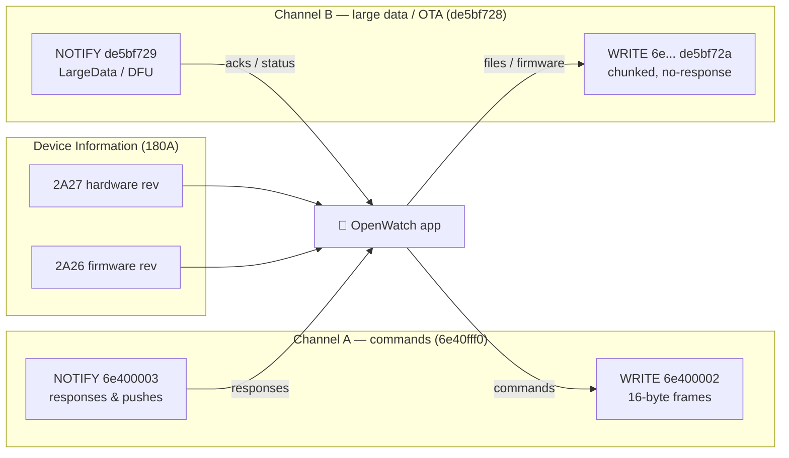

# QWatch Pro / Oudmon BLE Smartwatch — Reverse-Engineering Protocol Spec

> Canonical protocol reference for an open-source Flutter rewrite of `com.qcwireless.qcwatch`
> ("QWatch Pro"). Derived from static analysis of the shipped APK and cross-checked against H59MA
> firmware where noted. Where the source was ambiguous or a value could not be resolved statically,
> it is marked **TODO**. No opcodes are invented.

---

## 1. Overview

| Aspect | Value |
|---|---|
| User-facing app | **QWatch Pro** (`app_name`) |
| Android package | `com.qcwireless.qcwatch` |
| Vendor / OEM SDK | **Oudmon BLE SDK** (`com.oudmon.ble`) |
| Cloud vendor | QC Wireless (`com.qcwireless`) |
| Firebase project | `qwatchpro` (GCM sender `681190209674`) |
| Target SDK | Android 15 (SDK 35) |
| Device classes | Smart **rings** and **bracelets/watches** (same APK, capability-negotiated) |
| Audio/music stacks | Generic + **JieLi** (JL) SPP music streaming |
| OTA / DFU | **Oudmon-native DFU** over the large-data channel (Channel B). See note below. |

Firmware cross-reference: H59MA firmware r2 notes and address tables live in
[`firmwares/RE_FIRMWARE.md`](firmwares/RE_FIRMWARE.md). Firmware offsets there are `body.bin`
offsets unless noted; add `0x450` for the original `.bin` container offset.

**OTA / chip note.** Although the APK bundles a **Realtek** SDK (`com.realsil.sdk.*`), that code is the
**Bumblebee/bbpro audio-earbud** stack (ANC/APT/EQ/spatial-audio/local-playback) — **NOT** a watch DFU
service. **Watch firmware OTA is performed entirely by the Oudmon `DfuHandle` over Channel B**
(`de5bf728…`). The JieLi SPP code is music streaming, not file/OTA. Treat "Realtek = watch OTA" as
false.

**Transport.** All device communication is **BLE GATT**, over **two independent logical channels** on
the same connection (see §2). The cloud layer is a separate HTTPS/JSON + WebSocket API (see §6).

---

## 2. BLE Transport

### 2.1 GATT services & characteristics

| UUID | Role | Channel | Notes |
|---|---|---|---|
| `6e40fff0-b5a3-f393-e0a9-e50e24dcca9e` | **SERVICE** (command) | A | `UUID_SERVICE`. Vendor reused Nordic-UART `6e40*` base with `fff0` prefix. |
| `6e400002-b5a3-f393-e0a9-e50e24dcca9e` | WRITE | A | `UUID_WRITE`. Phone→watch 16-byte commands, `WRITE_TYPE_DEFAULT` (with response). |
| `6e400003-b5a3-f393-e0a9-e50e24dcca9e` | NOTIFY | A | `UUID_READ`. Watch→phone responses & pushes. CCCD enabled in `enableUUID()`. |
| `de5bf728-d711-4e47-af26-65e3012a5dc7` | **SERVICE** (large-data/file/OTA) | B | `SERIAL_PORT_SERVICE`. |
| `de5bf72a-d711-4e47-af26-65e3012a5dc7` | WRITE (no-response) | B | `SERIAL_PORT_CHARACTER_WRITE`. Chunked frames, `WRITE_TYPE_NO_RESPONSE`. |
| `de5bf729-d711-4e47-af26-65e3012a5dc7` | NOTIFY | B | `SERIAL_PORT_CHARACTER_NOTIFY`. Parsed by `LargeDataParser`/`DfuHandle`. |
| `00002902-0000-1000-8000-00805f9b34fb` | CCCD descriptor | A & B | `GATT_NOTIFY_CONFIG`. Written `ENABLE_NOTIFICATION_VALUE` on both notify chars. |
| `0000180A-…` | SERVICE Device Information | — | `SERVICE_DEVICE_INFO`. Read during handshake. |
| `00002A25-…` | READ Serial Number | — | DevInfo. |
| `00002A27-…` | READ Hardware Revision | — | `CHAR_HW_REVISION`. First handshake read. |
| `00002A26-…` | READ Firmware Revision | — | `CHAR_FIRMWARE_REVISION`. Second read (+200 ms); completion → `setReady(true)`. |
| `00002A23-…` | READ System ID | — | DevInfo. |
| `0000FEE7-…` | SERVICE Vendor "fee7" | — | Chinese-vendor profile. `fea1` write + CCCD, `fec9` read, `fea2` notify + CCCD, plus `2a00` Device Name. **Probe-only** in this app — see `firmwares/R2_ANALYSIS.md` §7. |
| `00002A28-…` | — | — | **Phantom.** Bytes at v13 `0x20faf` / v14 `0x1f363` look like `0x2a28` but are a `0x2803` char-decl followed by value-UUID `0x2a00` (Device Name, inside the `0xFEE7` service). The firmware does **not** declare a SW Revision characteristic. |

H59MA firmware stores the BLE UUIDs as little-endian table data and confirms both logical channels
plus the vendor `0xFEE7` service. Body offsets below are for the relevant **UUID bytes** (the
preceding attribute-table offset in `RE_FIRMWARE.md` differs by a few bytes — see
`firmwares/R2_ANALYSIS.md` §7 for the corrected table).

| UUID | v13 body offset | v14 body offset |
|---|---:|---:|
| Device Info service | `0x20c78` | `0x1f02c` |
| Serial Number `2a25` | `0x20cae` | `0x1f062` |
| HW revision `2a27` | `0x20ce6` | `0x1f09a` |
| FW revision `2a26` | `0x20d1e` | `0x1f0d2` |
| System ID `2a23` | `0x20d56` | `0x1f10a` |
| Channel B service `de5bf728` | `0x20d7c` | `0x1f130` |
| Channel B write `de5bf72a` | `0x20dc6` | `0x1f17a` |
| Channel B notify `de5bf729` | `0x20dfe` | `0x1f1b2` |
| Channel A service `6e40fff0` | `0x20e40` | `0x1f1f4` |
| Channel A write `6e400002` | `0x20e8a` | `0x1f23e` |
| Channel A notify `6e400003` | `0x20ec2` | `0x1f276` |
| Vendor `0xFEE7` service | `0x20f08` | `0x1f2bc` |
| Vendor `fea1` write | `0x20f3e` | `0x1f2f2` |
| Vendor `fec9` read | `0x20f92` | `0x1f346` |
| Vendor `fea2` notify | `0x20fca` | `0x1f37e` |
| Device Name `2a00` | `0x20fb0` | `0x1f364` |



### 2.2 MTU

- **Channel A** does **no** MTU negotiation. `onMtuChanged` is a bare super-call. Incoming notifies
  **must** be exactly 16 bytes (`CMD_DATA_LENGTH=0x10`) or they are dropped.
- **Channel B** chunk size = `JPackageManager.getLength()`, default **`0x14` = 20 bytes**
  (classic ATT MTU 23 − 3). Negotiable upward via the device's **PackageLength** notify (opcode
  `0x2f`), floored at `0x14`: `setLength(max(devValue, 0x14))`.

### 2.3 Connection & handshake sequence

```mermaid
sequenceDiagram
    participant P as Phone
    participant W as Watch

    P->>W: GATT connect
    W-->>P: connected
    P->>W: discoverServices()
    P->>W: write CCCD ENABLE on 6e400003 (Channel-A notify)
    Note over P: 4s watchdog armed; FW-timeout at +500/1500/2500 ms
    P->>W: ReadRequest(180A, 2A27)
    W-->>P: hardware revision
    P->>W: +200 ms ReadRequest(180A, 2A26)
    W-->>P: firmware revision
    Note over P,W: setReady(true) — Channel-A WRITES now allowed<br/>(reads were never gated)
    rect rgb(235,245,255)
    note right of P: App layer (after ready)
    P->>W: bind (0x10)
    P->>W: SetTime (0x01)
    W-->>P: SetTimeRsp = capability manifest
    P->>W: DeviceSupportReq (0x3c)
    W-->>P: support bitmap
    end
```

Until `ready == true`, Channel-A **writes** are rejected (`"init not complete"`);
Device-Info **reads** are not gated.

The SDK transport itself sends **no** automatic bind/SetTime; those are app-level commands issued once
`ready`.

### 2.4 Write queue

- Single serialized queue: `BleOperateManager.execute` → runnable on a `HandlerThread`.
- Each GATT op blocks on a `waitUntilActionResponse`/`notifyLock` handshake — **one** GATT operation
  at a time, **5000 ms** timeout.
- Every GATT callback (write / read / notify-config / notify) calls `notifyLock()` to release the next
  queued op.

---

## 3. Packet Framing

### 3.1 Channel A — command channel (fixed 16-byte frames)

```
 byte:  0        1                              14       15
       +--------+------------------------------+--------+
       | opcode |  subData payload (zero-pad)  |  CRC8  |
       +--------+------------------------------+--------+
        ^                                       ^
        key/Constants.CMD_*                     sum(bytes[0..14]) & 0xFF
        (RX: high bit 0x80 = ERROR flag,        (additive 8-bit checksum,
         masked off to get base opcode)          NOT CRC16)
```

- **Always** 16 bytes. No fragmentation on this channel — long data must use Channel B.
- **Channel-A framing is built phone-side, but dispatch is implemented on both sides.** The Oudmon
  SDK builds frames, computes the additive CRC8, and dispatches responses on the phone. The H59MA
  v14 firmware also contains a real dispatcher at `FUN_0082d2dc` (`0x0082d2dc`) that reads the opcode
  from a queued 16-byte frame and calls per-opcode handlers (see `firmwares/GHIDRA_DECOMPILATION.md`
  §3). The v13 bucket table at `0x22490` remains unreferenced dead code; the v14 dispatcher uses a
  direct switch/case instead. **v13 ↔ v14 are wire-compatible** — v14 is a debug-log strip +
  dead-table cleanup, no protocol change.
- TX build (`BaseReqCmd.getData`): `buf=new byte[16]; buf[0]=key; arraycopy(getSubData,0,buf,1,len); addCRC(buf)`.
- RX dispatch (`QCBluetoothCallbackReceiver.onCharacteristicChange` on `6e400003`):
  1. len **must** == 16 else dropped.
  2. `checkCrc` must pass else dropped.
  3. `opcodeKey = data[0] & ~0x80` (strip `FLAG_MASK_ERROR`; the top bit signals device-side error).
  4. Try `parserAndDispatchReqData`: look up per-request `LocalWriteRequest` in
     `localWriteRequestConcurrentHashMap[opcodeKey]` (registered by `executeReqCmd` when an
     `ICommandResponse` callback was supplied). Build/accumulate `Rsp` via
     `BeanFactory.createBean(opcodeKey, type)`, `acceptData(payload)`.
  5. Else fall back to `parserAndDispatchNotifyData(notifySparseArray, data)` — the persistent
     listener registry (pre-registered: `0x1d` Music, `0x02` InnerCamera, `0x2f` PackageLength,
     `0x73` DeviceNotify, `0x78` DeviceSportNotify; plus dynamic `addNotifyListener` etc.).
- **RX payload** to `Rsp.acceptData` = `bytes[1..14]` (opcode + CRC stripped), so `payload[0]` == frame
  `byte[1]` == first subData byte.
- **Multi-packet accumulation** (`tempRspDataSparseArray[opcodeKey]`): `acceptData()` boolean is
  **inverted** — **`true` = need more packets**, **`false` = complete** (fire `onDataResponse`, delete temp entry).

#### Mixture sub-command convention (read/write/delete)

For settings that are readable & writable (`MixtureReq` subclasses), **`subData[0]` is a sub-opcode**:

| subData[0] | Meaning |
|---|---|
| `0x01` | READ (query current value) — `getReadInstance()` |
| `0x02` | WRITE (set value) — `getWriteInstance(...)` |
| `0x03` | DELETE / clear — `getDeleteInstance()` |

Boolean encoding gotchas:
- Most writes: **`1` = on, `2` = off** (NOT 1/0).
- A few invert via XOR-1 so the wire byte is the logical-NOT (`0=on,1=off`): **TimeFormat is24/metric**,
  **MusicSwitch playing**.
- Some health settings use raw `0/1` int-to-byte (BloodOxygen/Pressure/UV/HRV).

### 3.2 Channel B — large-data / file / OTA (length-prefixed + CRC16)

```
 byte:  0      1     2    3     4    5     6 ...
       +------+-----+----------+----------+-----------+
       | 0xBC | cmd | len (LE) | CRC16(LE)|  payload  |
       +------+-----+----------+----------+-----------+
        magic       u16 little  u16 little
                    -endian     -endian, over PAYLOAD ONLY
```

- `byte[0]` = `0xBC` magic (the `-0x44` in smali).
- `byte[1]` = cmd / action id.
- `byte[2..3]` = payload length, **uint16 LE** (`DataTransferUtils.shortToBytes`).
- `byte[4..5]` = **CRC16 of payload only** (`CRC16.calcCrc16`), uint16 LE.
- `byte[6..]` = payload.
- **Empty payload** ⇒ `bytes[2..5]` = `FF FF FF FF` (sentinel; len/crc omitted).
- Whole frame wrapped in `BleDataBean(data, subLength)` → `BleThreadManager` → `BleConsumer` slices into
  `subLength`-byte no-response writes to `de5bf72a`. `subLength` = `JPackageManager` length (default 20).
- RX (`onReceivedData` on `de5bf729`): `byte[0]` must == `0xBC`; `byte[1]` = cmd; first packet
  `byte[2..3]` = total count/size; routed via `LargeDataHandler.respMap` keyed by cmd id.

### 3.3 CRC summary (per-channel — they differ!)

| Channel | Algorithm | Scope |
|---|---|---|
| A | additive 8-bit sum `& 0xFF` | bytes `[0..14]` |
| B | CRC-16/MODBUS (`poly=0xA001`, init `0xFFFF`) | **payload only** (not header) |

Firmware evidence for Channel B: r2 disassembly of H59MA v13 at body `0x8c54..0x8c9c` and v14 at
`0x8c0c..0x8c54` checks `len >= 6`, compares byte 0 with `0xBC`, reads `len16LE` from bytes 2/3,
reads `crc16LE` from bytes 4/5, and copies payload from byte 6. The CRC helpers at v13
`0x8d5c..0x8d9a` and v14 `0x8d14..0x8d52` use init `0xFFFF` and lookup tables at v13 `0x2100c` and
v14 `0x1f3c0`, whose first words match the canonical reflected `0xA001` table.

Firmware evidence for Channel-A buckets: v13 body `0x22490` is a one-byte-per-opcode bucket table
matching the APK-derived command families: `0x01..0x09` and `0x0f..0x20` plain request bucket `0x40`,
`0x0a..0x0e` mixture bucket `0x41`, `0x22..0x30` notify/push bucket `0x02`, `0x42..0x47` bucket
`0x90`, `0x48..0x5b` bucket `0x10`, `0x62..0x67` bucket `0x88`, and `0x68..0x7b` bucket `0x08`.
The same contiguous table was not found in v14, but its command literal table moved from v13
`0x21b58` to v14 `0x1ff0c`.

### 3.4 Endianness cheat-sheet (the #1 gotcha — three helpers!)

| Helper | Endianness | Used by |
|---|---|---|
| `DataParseUtils.intToByteArray` | **LE** 4B | `ReadBandSportReq`, weather timestamp |
| `DataParseUtils.byteArrayToInt` | **BE** | `ReadSportRsp` field decode |
| `BLEDataFormatUtils.bytes2Int` | **BE** | TotalSport/TodaySport/ReadDetailSport (callers re-order arrays) |
| `ByteUtil.bytesToInt` | **LE** | AppSport/AppGps timestamp, TargetSetting fields, Channel-B sleep |
| `ByteUtil.intToByte` | **LE** | `PhoneGpsReq` distance/calorie |
| `DataTransferUtils.intToBytes/shortToBytes` | **LE** | Target write (low 3 bytes → 24-bit LE), Channel-B headers |

BCD: hours/minutes/days/months/year-offset use `BLEDataFormatUtils.decimalToBCD` / `BCDToDecimal`.
Year = `BCD(byte) + 2000` (`0x7d0`).

---

## 4. Command Reference

> Offsets in **Response** columns are **payload-relative** (`payload[0]` = frame `byte[1]`).
> `acceptData` returns `true`=need-more / `false`=done.

### 4.1 Transport primitives

| Name | Opcode | Sub | Dir | Request | Response | Meaning |
|---|---|---|---|---|---|---|
| WriteRequest | n/a | — | →watch | 16B `[op][subData][crc8]` to `6e400002` | 16B notify on `6e400003` by opcode | Channel-A command write. `WRITE_TYPE_DEFAULT(2)`, or `NO_RESPONSE(1)` when noRsp. |
| LocalWriteRequest | n/a | — | →watch | same 16B frame | `BeanFactory.createBean(op,type).acceptData(bytes[1..14])` | WriteRequest + `ICommandResponse` waiter + type; correlates response by opcode. |
| ReadRequest | n/a | — | →watch | `readCharacteristic(180A, 2A27/2A26/2A28)` | raw ASCII revision string | Device-Info reads during handshake only. |
| EnableNotifyRequest | n/a | — | →watch | CCCD(`00002902`)=ENABLE; `writeDescriptor` | `onDescriptorWrite → enable(bool)` | Enable notify on `6e400003` and `de5bf729`. |
| Large-data write | `0xBC` | cmd@[1] | →watch | `[BC][cmd][len16LE][crc16LE][payload]`; empty⇒`FF FF FF FF` | inbound on `de5bf729`, routed by cmd id | Channel-B framed write, sliced into `subLength` chunks. |

### 4.2 Device & display (Channel A)

| Name | Opcode | Sub | Dir | Request | Response | Meaning |
|---|---|---|---|---|---|---|
| SetTimeReq | `0x01` | — | →watch | `[BCD y,mo,d,h,mi,s][lang][tzHalfHour+1]` (8B; tz=`((off+24)%24)*2+1`) | **SetTimeRsp** = 14B capability bitmap (see §4.2.1) | Set clock; reply doubles as device capability manifest (screen w/h, max faces/contacts). |
| DeviceSupportReq | `0x3c` | — | →watch | empty subData | **DeviceSupportFunctionRsp** bitmap (see §4.2.2) | Feature-support probe; usually first after ready. |
| DeviceThemeReq | `0x3d` | 01/02 | →watch | r:`[01]` w:`[02,theme]` | DeviceThemeRsp: `pl[1]`=type; type==1⇒`pl[2..]`=UTF name | Get/set UI theme id. |
| DeviceWallpaperReq | `0x3f` | 01/02 | →watch | r:`[01]` w:`[02,value]` | DeviceWallpaperRsp: `pl[1]`=type; type==1⇒`pl[2..]`=UTF name | Get/set wallpaper. |
| DeviceAvatarReq | `0x32` | — | →watch | empty subData | `pl[0]`=screenType; `pl[1..2]`=avatarWidth LE; `pl[3..4]`=height LE | On-device avatar canvas geometry. |
| DisplayClockReq | `0x12` | 01/02 | →watch | w:`[02, en?1:2]` | state echo `pl[1]` (1/2) | Always-on/display clock. |
| DisplayOrientationReq | `0x29` | 01/02 | →watch | w:`[02, p1?1:2, (p1?0:(p2?1:2))]` | status | Screen orientation/auto-rotate. |
| DisplayStyleReq | `0x2a` | 01/02 | →watch | w:`[02, style]` | status | Display style id. |
| DisplayTimeReq | `0x1f` | 01/02/03 | →watch | w:`[02, displayTime, displayType, alpha, 0x00, total, curr]` (idx4 reserved) | status | Screen-on duration/brightness profile (read/write/delete). |
| BrightnessSettingsReq | `0x1b` | 01/02 | →watch | w:`[02, level]` | status | Screen brightness. |
| DegreeSwitchReq | `0x19` | 01/02 | →watch | w:`[02, en?1:2, isCelsius?1:2]` | status | Temperature unit/degree display. |
| TimeFormatReq | `0x0a` | 01/02 | →watch | w:`[02, is24^1, lang]` (+profile variants, see note) | status | 12/24h + optional user profile/health baselines. is24 (& metric in $3) XOR-1 inverted. |
| DndReq | `0x06` | 01/02 | →watch | w:`[02, en?1:2, sH, sM, eH, eM]` | status | Do-Not-Disturb schedule. |
| PalmScreenReq | `0x05` | 01/02 | →watch | w:`[02, p1?1:2, (p2?1:2)|(p3?4:0)]` (p3 always true in factory) | status | Palm/cover gesture. |
| IntellReq | `0x09` | 01/02 | →watch | w:`[02, en?1:2, delaySecond]` | status | Smart-feature toggle + delay. |
| TouchControlReq | `0x3b` | multiplexed | →watch | read:`[01, on?0:1]`; readTouch:`[01,02]`; tpSleep:`[02,02,a,b]`; write:`[02,(p2?00:01),p1,p4/p3]` | status | Touch/TP-sleep control. `subData[1]`=sub-key. |
| FindDeviceReq | `0x50` | — | →watch | `[0x55, 0xAA]` magic | FindPhoneRsp/status | Make the watch ring/vibrate. |
| CameraReq | `0x02` | action | →watch | `[action]` (4=enter UI, 5=keep-screen-on, 6=finish; ctor throws if <4/>6) | **CameraNotifyRsp** (watch→phone shutter) | Remote-camera control. ⚠ opcode `0x02` collides with InnerCamera notify key. |
| SimpleKeyReq | caller-supplied | — | →watch | `[op]` only (subData null). Seen: `0x03`, `0x08` | status | Generic opcode-only trigger. Base of RestoreKeyReq. |
| RestoreKeyReq | caller-supplied | — | →watch | `[0x66, 0x66]` confirm magic | status | Factory reset / restore defaults. |

**TimeFormat profile variants** (all `subData[0]=0x02`):
`$1`(10B): `[02,is24^1,metric,sex,age,height,weight,sbp,dbp,rateWarn]`.
`$2`(11B): `…+open`.
`$3`(11B): `[02,is24^1,metric^1,sex,age,height,weight,sbp,dbp,rateWarn,open]` (metric also XOR-1).

#### 4.2.1 SetTimeRsp 14-byte capability bitmap (payload-relative)

| Byte | Bits → flags |
|---|---|
| `pl[0]` | `==1` ⇒ mSupportTemperature |
| `pl[1]` | b0 Plate, b1 BloodSugarCheck, b2 Stock, b3 AppInstall, b4 Quick, b5 DeviceLayout, b6 Heart, b7 Sleep |
| `pl[2]` | b0 Menstruation |
| `pl[3]` | b0 CustomWallpaper, b1 BloodOxygen, b2 BloodPressure, b3 Feature, b4 OneKeyCheck, b5 Weather, b6 WeChat(**inverted** 0⇒true), b7 Avatar |
| `pl[4..5]` | width (LE int) |
| `pl[6..7]` | height (LE int) |
| `pl[8]` | `==1` ⇒ NewSleepProtocol |
| `pl[9]` | mMaxWatchFace |
| `pl[0xa]` | b0 Contact, b1 Lyrics, b2 Album, b3 GPS, b4 JieLiMusic, b5 AppMeasure |
| `pl[0xb]` | b0 ManualHeart, b1 ECard, b2 Location, b4 MusicSupport, b5 rtkMcu, b6 EbookSupport, b7 BloodSugar |
| `pl[0xc]` | contacts: 0⇒maxContacts=20 else value*8 |
| `pl[0xd]` | b0 Record, b1 bpSetting, b2 4G, b3 NavPicture, b4 Stress/Pressure, b5 HRV, b6 BloodLipids, b7 UricAcid |

#### 4.2.2 DeviceSupportFunctionRsp bitmap (payload-relative)

Most APK-era devices return the bitmap below. H59MA firmware is a special case:
the same Channel-A `0x3c` opcode falls through to the FEE7 capability handler
(`FUN_0082c50e`) and returns a fixed product capability block instead of this
bitmap. Live H59MA_V1.0 v13 capture:
`3c 00 40 00 80 00 00 00 20 00 00 00 00 00 00 1c`; v14 RE notes show the
same opaque feature-ID shape with IDs at bytes 2/7/11. Treat those fixed blocks
as the H59MA app-level feature set (HR, SpO2, pressure/BP, new sleep), not as
the generic bitmap below.

| Byte | Bits → flags |
|---|---|
| `pl[1]` | b0 Touch, b1 Moslin, b2 APPRevision, b3 BlePair, b4 WatchTheme, b6 deviceNoScreen |
| `pl[3]` | b7 AiAnalyze |
| `pl[4]` | b0 MenuWallpaper, b2 WechatPay |
| `pl[5]` | b7 Moslin(overwrite), onlyTouch |
| `pl[6]` | b2 notSupportTakePhoto, b3 LoverSpace, b4 Worship, b5 NewPraise, b6 Alarm, b7 DoNotDisturb |
| `pl[7]` | b0 Ultraviolet, b3 RealTimeHr, b4 RealTimeHrRemind, b5 Friends |
| `pl[8]` | b0 NoScreen24Hour, b1 NoScreenDrinkRemind, b2 NoScreenBrightScreenTime, b3 ReduceFat, b4 hideMessageNotification |
| `pl[0xa]` | b1 ⇒ Temperature200 |

### 4.3 Health sensors (Channel A)

| Name | Opcode | Sub | Dir | Request | Response | Meaning |
|---|---|---|---|---|---|---|
| ReadHeartRateReq | `0x15` | — | →watch | `[1..4]`=utcStart i32 LE | **ReadHeartRateRsp** multi-pkt (hdr `pl[0]=00`{size,range}, data `pl[0]=01`{ts i32 LE + samples}, `0xFF`/`0x17`=end). stride 13B. | Read stored HR history. Up to 288 5-min slots/day. |
| HeartRateSettingReq | `0x16` | 01/02 | →watch | w2:`[02,en?1:2,interval]`; w5:`+[startInterval,tooLow,tooHigh]` | read: `[1]`en, `[2]`interval, `[3]`startInterval, `[4]`tooLow, `[5]`tooHigh | HR auto-measure config + hi/lo alarms. |
| RealTimeHeartRate | `0x1e` | — | →watch | `[type]` | `pl[0]`=instantaneous bpm | Toggle/poll realtime HR stream. |
| StartHeartRateReq | `0x69` | type | →watch | `[type, sub]` (type enum below) | `[0]`type `[1]`errCode `[2]`value; if len≥5 `[3]`sbp `[4]`dbp | Start a measurement session. |
| StopHeartRateReq | `0x6a` | type | →watch | `[type, p2, p3]` (factories per type) | `[0]`type `[1]`err `[2]`value; len≥5 `[3]`sbp `[4]`dbp | Stop a measurement. (per-request waiter) |
| ReadPressureReq | `0x14` | — | →watch | `[1..4]`utcStart i32 LE `[5]=00` `[6]=0x32` | **ReadBlePressureRsp**: `[0..3]`ts i32 LE (`0xFFFFFFFF`=end), `[4]`val, `[5]`val2 → BlePressure. ≤50 records. | Read BLE-pressure measured values. |
| BloodOxygenSettingReq | `0x2c` | 01/02 | →watch | w:`[02, en(0/1)]` | read: `[1]`enable | SpO2 auto-measure on/off. |
| BpSettingReq | `0x0c` | 01/02 | →watch | w:`[02,en,sH,sM,eH,eM,multiple]` | read: `[1]`en,`[2..5]`window,`[6]`multiple | BP auto-measure window. |
| BpReadConformReq | `0x0e` | — | →watch | `[0x00]`=ok / `[0xFF]`=fail | (none; BP history via `0x0d`) | Ack a BP measurement result. |
| BpDataRsp (no req) | `0x0d` | — | watch→ | n/a | hdr `[0]=00`{`[1]`yr-2000,`[2]`mo,`[3]`d,`[4]`slotMult,`[5..10]`48-bit presence bitmap}; data `[0]=01`{13B records}; `0xFF`=end | BP history records. |
| HRVReq | `0x39` | index | →watch | `[index]` | multi-pkt (`[0]=00`{size,range=30}, `[0]=01`{offset days-back + samples}, `0xFF`=end). stride 13B. | Read HRV history for a day index. |
| HrvSettingReq | `0x38` | 01/02 | →watch | w2:`[02,en]`; w4:`[02,en,(ten?0x0a:0),interval]` | read: `[1]`en,`[2]`tenInterval,`[3]`interval(def 30) | HRV auto-measure config. |
| PressureReq | `0x37` | index | →watch | `[index]` | multi-pkt (same scheme as HRV). stride 13B. | Read stress history for a day index. |
| PressureSettingReq | `0x36` | 01/02 | →watch | w:`[02,en(0/1)]` | read: `[1]`enable | Stress auto-measure on/off. |
| UltraVioletReq | `0x7d` | index | →watch | `[index]` | multi-pkt (same scheme). stride 13B. | Read UV-index history for a day index. |
| UVSettingReq | `0x3e` | 01/02 | →watch | w:`[02,en(0/1)]` | read: `[1]`enable | UV auto-measure on/off. |
| SugarLipidsSettingReq | `0x3a` | type+act | →watch | r:`[type,01]`; w:`[type,02,en(0/1),valLo,valHi]` | `[1]`act, if read `[0]`type,`[2]`en,`[3..4]`value LE,`[5]`supportUnit | Blood sugar/lipids reference config. (per-request waiter) |
| MenstruationReq | `0x2b` | 01/02 | →watch | w(11B):`[02,p1,p2,p3,p4,p5,p6,p7,p8,p9,p10]` | **MenstruationDataRsp**: stub — logs hex only, returns true (SDK does NOT decode body) | Menstrual-cycle config. |
| HealthEcgRsp (notify) | **TODO** | — | watch→ | n/a (session under `0x69` type=7) | len≥3: `[0]`status,`[1]`ecgInterval,`[2]`ppgInterval | ECG status during ECG session. Listener opcode not statically resolvable. |
| PpgDataRspCmd (notify) | **TODO** | — | watch→ | n/a (ECG/PPG session) | `[0]`rate; ppgValue=`bytesToInt([1..4])` i32 LE | Raw PPG + HR stream. Listener opcode unresolved. |

**StartHeartRate type enum:** HEARTRATE=1, BLOODPRESSURE=2, BLOODOXYGEN=3, FATIGUE=4, HEALTHCHECK=5,
REALTIMEHEARTRATE=6, ECG=7, PRESSURE=8, BLOOD_SUGAR=9, HRV=0xa, BODY_TEMPERATURE=0xb.
**Action enum:** START=1, PAUSE=2, CONTINUE=3, STOP=4.

### 4.4 Activity / sport / sleep / alarm / target

| Name | Opcode | Sub | Dir | Request | Response | Meaning |
|---|---|---|---|---|---|---|
| ReadBandSportReq | `0x13` | — | →watch | `[1..4]`ts u32 LE | **ReadSportRsp** multi-pkt: hdr `b0=00,b1=size`(*13); records 13B; 7×4B **BE** fields [startTime,duration,sportType,stepCount,distance,calories,hrCount] + hrCount HR bytes; `0xFF`=end | Read one stored exercise session. |
| ReadDetailSportDataReq | `0x43` | `0x0F`@[1] | →watch | `[dayOffset,0F,startSeg,endSeg(≤0x5f),01]` | paged BleStepDetails: `0xFF`=clear, `0xF0`=init(`b2==1`⇒calorie*10); data `[0]`yr-2000,`[1]`mo,`[2]`d,`[3]`segIdx, cal/steps/dist=`bytes2Int` of swapped pairs; `b4`=page,`b5`=total; done when `b4==b5-1` | Per-slot step detail for a day. |
| ReadTotalSportDataReq | `0x07` | — | →watch | `[dayOffset]` | **TotalSportDataRsp** paged: `b0`=page idx, first page `b1`=daysAgo BCD, no-data if `b2==b3==b4==0`; 3B BE groups → BleStepTotal (steps/calorie/distance) across pages | Aggregated daily step total. |
| PhoneSportReq | `0x77` | — | →watch | `[status, sportType]` | **AppSportRsp**: `b0`=gpsStatus; if==6 `ts=bytesToInt(b[2..6])` u32 LE | Tell watch the phone's app-side sport status. |
| PhoneGpsReq | `0x74` | — | →watch | gps:`[status,00]`; phoneData:`[05,00]+dist u32 LE+cal u32 LE` | **AppGpsRsp**: same shape as AppSport | GPS/outdoor-sport coordination. |
| ReadSleepDetailsReq | `0x44` | `0x0F`@[1] | →watch | `[dayOffset,0F,startSeg,endSeg(≤0x5f)]` | paged BleSleepDetails: `0xFF`=clear, `0xF0`=init; data `[0]`yr-2000,`[1]`mo,`[2]`d,`[3]`idx, `sleepQualities[8]=b[5+i]`; `b4`/`b5` page/total | Legacy per-slot sleep detail. |
| SetAlarmReq | `0x23` | — | →watch | `[idx(0..4),en(0..2),hourBCD,minBCD, day0..day6]` (11B; 7 weekday flags from weekMask bits) | SimpleStatusRsp ack | Set clock alarm slot. |
| ReadAlarmReq | `0x24` | — | →watch | `[idx(0..4)]` | **ReadAlarmRsp**: `weekMask=Σ(b[4+i]<<i)`; AlarmEntity(idx,en,BCD h/m,weekMask) | Read clock alarm slot. |
| SetDrinkAlarmReq | `0x27` | — | →watch | same 11B layout as SetAlarm, idx 0..7 | ack | Drink/sedentary reminder slot. ⚠ Channel-B sleep also uses cmd `0x27`. |
| ReadDrinkAlarmReq | `0x28` | — | →watch | `[idx(0..7)]` | ReadAlarmRsp (same as `0x24`) | Read drink/sedentary slot. |
| SetSitLongReq | `0x25` | — | →watch | `[sH,sM,eH,eM (BCD), weekMask, cycle]` cycle∈{30,60,90}s else 30 | ack | Sedentary reminder window. |
| ReadSitLong | `0x26` | — | →watch | bare opcode read | **ReadSitLongRsp**: BCD window, `b4`=weekMask, `b5`=cycle | Read sedentary config. |
| TargetSettingReq (read) | `0x21` | `0x01` | →watch | `[01]` | **TargetSettingRsp** `readSubData`: step `b[1..4]`(3B LE), calorie `b[4..7]`, distance `b[7..10]`, sport `b[10..12]`(2B), sleep `b[12..14]`(2B) | Read daily goals. |
| TargetSettingReq (write s/c/d) | `0x21` | `0x02` | →watch | `[02]+step LE24+cal LE24+dist LE24` (10B) | echo via TargetSettingRsp | Write step/cal/dist goals. |
| TargetSettingReq (write +sport/sleep) | `0x21` | `0x02` | →watch | `…+sportMin u16 LE+sleepMin u16 LE` (14B) | echo | Extended goal write. |
| TodaySportData | `0x48` | — | watch→ | (read) bare opcode | **TodaySportDataRsp**: 3B **BE** groups — totalSteps `b[0..2]`, running `b[3..5]`, calorie `b[6..8]`, walkDist `b[9..11]`, sportDur `b[12..13]`(2B) | Today's running step total. |
| SleepNewProtoResp (night) | `0x27` (Ch B) | — | watch→ | Ch-B `[BC,27,len,crc,dayOffset]` | parseDaySleep: chained day blocks; endMinuteOfDay (u16 LE) → et=midnight+min*60; from offset 6 pairs (type,durMin) → DetailBean; st=et−Σd*60 | Night sleep (new protocol). |
| SleepNewProtoResp (lunch) | `0x3e` (Ch B) | — | watch→ | Ch-B `[BC,3e,len,crc,payload]` | parseDaySleepLunch: lunchBreak=true, lunchSt/Et, lunchList[LunchSleepBean] | Lunch/nap sleep. |
| AppSport (notify) | `0x77` | — | watch→ | n/a | `b0`=gpsStatus; if==6 ts=`bytesToInt(b[2..6])` LE | Watch requests phone GPS-sport sync. |
| AppGps (notify) | `0x74` | — | watch→ | n/a | same as AppSport | Watch GPS sync notify. |

### 4.5 Notifications / weather / Muslim (Channel A)

| Name | Opcode | Sub | Dir | Request | Response | Meaning |
|---|---|---|---|---|---|---|
| BindAncsReq | `0x04` | `0x02` | →watch | `[02, verBucket, UTF-8 MODEL≤13B]` (verBucket: 0x0a SDK29/30, 0x09 SDK28, 0x08 SDK26/27, else 0); fallback `[02]` | status | Register phone identity for ANCS attribute parsing. |
| SetANCSReq | `0x60` | — | →watch | `[FF,9F,FF,FF]` | **ReadANCSRsp**: `pl[0..1]`=stateMask u16 LE | Subscribe ANCS categories (near-all). |
| SetMessagePushReq | `0x61` | — | →watch | empty | **ReadMessagePushRsp**: deviceSupport1/2/3 = ints @off 2/4/6 | Query message-push capability. |
| PushMsgUintReq | `0x72` | — | →watch | `[type, argB, argC, content…]` | **PhoneNotifyRsp** (push): `action=pl[0]&0xff`; isReject ⇔ action==1 | Push a notification to watch. |
| BlackListReq | `0x2d` | — | →watch | `[0x01]` | (none) | Contact black-list enable/read. |
| LoverEventReq | `0x51` | — | →watch | `[0x01]` | (none) | Lover/anniversary event command. |
| CallForwardSettingReq | `0x33` | 01/02 | →watch | r:`[01]`; w:`[02, type(0=off), numLen, UTF-8 number]` | **CallForwardRsp** `readSubData`: `p[1]`type, `p[2]`numLen N, `p[3..3+N]` UTF-8 number | Call-forwarding target. |
| WeatherForecastReq | `0x1a` | — (write-only) | →watch | `[index, ts u32 LE, weatherType, minDeg, maxDeg, humidity, takeUmbrella(1/2)]` (10B) | **WeatherForecastRsp**: isSuccess ⇔ `pl[0]==0x1a` | Push one day of weather. |
| AgpsReq | `0x30` | 01/02 | →watch | r:`[01]`; w:`[02, en(0/1)]` | **AgpsRsp**: mEnable ⇔ `pl[1]==1` | Read/toggle A-GPS. |
| MuslimReq | `0x7a` | 01/02 | both | read-paged:`[01,index]`; trigger:`[02,01]` | **MuslimRsp** multi-pkt: `pl[0]`tag (`0x00`hdr{size,range}, `0x01`first{offset days-back + data}, other=cont, `0xFF`=end). stride 13B (prayer times) | Read prayer-time table. |
| MuslimRemindReq | `0x52` | 01/02 + dataType@[1] | both | read-alg:`[01,03]`; alg-write:`[02,03,algIdx,asrIdx]`; timer:`[02,01,p1..p6]`; DND:`[02,02,sHBCD,sMBCD,eHBCD,eMBCD,sw,weekday,cycle(0x3c/0x78/0xb4)]` | **MuslimRemindRsp** `pl[1]`=dataType: t1 `[2]`idx`[3]`en`[4]`hBCD`[5]`mBCD`[6]`offset`[7]`advance; t2 window+`[6]`sw`[7]`weekday`[8]`cycle; t3 `[2]`algIdx`[3]`asrIdx | Prayer reminders / adhan alarms. |
| MuslimTargetReq | `0x7b` | 01/02 + targetType@[1] | both | r:`[01,type]`; t1:`[02,01]+target(4B)[+en?1:2]`; t2:`[02,02]+n(1B)+target(4B)`; t3:`[02,03]+[open?1:2]+n+target(4B)`; t4/5:`[02,type]+fields+2B items` | **MuslimTargetRsp** branches on `pl[1]`: threeIsOpen/hundredIsOpen/nIsOpen, nTargetNum, muslimTarget(4B LE), enable, paged customerPriseList(4B ints) | Tasbih/dhikr counter targets. |

### 4.6 Channel-A status responses (no request class found here)

| Name | Opcode | Dir | Response | Meaning |
|---|---|---|---|---|
| PackageLengthRsp / notify | `0x2f` | watch→ | `mData = pl[0] & 0xFF` → `JPackageManager.setLength(max(v,0x14))` | Channel-B chunk-size negotiation (single unsigned byte). ⚠ `0x2f` is also `ACTION_E_CARD` on Channel B — different channel. |
| QueryDataDistributionRsp | `0x46` | watch→ | `distribution = bytes2Int(pl[0..3])` (BE); `isTheDayHasData(day)=(distribution>>day)&1` | 32-day bitmask of which days have stored health data. |
| SwitchOTARsp | `0x0f` | watch→ | `stateMask = bytesToShort(pl,0)` (2B LE) | Device entered OTA mode; 16-bit capability mask. Precedes the `de5bf728` DFU flow. |

### 4.7 Channel-B LargeData actions (cmd id @ `byte[1]`; `payload[0]`=0x01 read / 0x02 write)

| Name | cmd | Dir | Request | Response | Meaning |
|---|---|---|---|---|---|
| readCustomWatch | `0x3a` | →watch | `[01]` | respMap[0x3a] | Read DIY watch-face definition. |
| writeCustomWatch | `0x3a` | →watch | `[02] + N×8B elements {type, x u16 LE, y u16 LE, R,G,B}` | ack | Upload DIY watch-face. |
| readQrCode / E-Card | `0x2f` | →watch | `[01, type]` (no frame if type==0xFF) | respMap[0x2f] | Read stored QR/e-card by type. |
| writeQrCode / E-Card | `0x2f` | →watch | `[02, type, urlLen] + UTF-8 url` (`[02,FF,00]` to query/clear) | ack | Write QR/e-card. |
| setDeviceNickName | `0x4a` | →watch | nickname bytes (`ACTION_AVATAR_Device`) | ack | Set device nickname. ⚠ overloaded: also AvatarHandle image upload. |
| readAlarm / writeAlarm | `0x2c` | →watch | r:`[01]`; w:`[02]+AlarmNewEntity` | respMap[0x2c] | New-protocol alarms. |
| readSmsQuick / writeSmsQuick | `0x4c` | →watch | r:`[01]`; w:`[02]+SmsQuickBean` | respMap[0x4c] | Quick-reply SMS templates. |
| LargeData action id table | varies | both | `byte1`=action; `payload[0]`=01/02 | respMap[action] | `0x20` Location, `0x27` NewSleep, `0x28` ManualHeartRate, `0x29` Contacts_New, `0x2a` Blood_Oxygen, `0x2c` Alarm, `0x2d` Contact, `0x2e` BT_MAC, `0x2f` E_CARD/QrCode, `0x3a` Custom_WatchFace, `0x3e` NewSleep_Lunch, `0x47` Blood_Sugar, `0x48` GPS_Navigation, `0x49` Manual_Oxygen, `0x4a` AVATAR_Device(nickname), `0x4c` SMS_QUICK, `0x5f` Interval_Blood_Oxygen, `0x75` Interval_Heart_Rate. |

### 4.8 Channel-B file transfer (FileHandle / Avatar / Album / Ebook / Record / Temperature)

| Name | cmd | Dir | Request | Response | Meaning |
|---|---|---|---|---|---|
| FileHandle start (list) | `0x30` | →watch | empty | parseFileInfo: {len,name} list | Begin file-listing/directory. `currFileType`: 1=MarketWatchFace, 2=DiyWatchFace, 3=DismissFile, 4=OtaFile. |
| cmdFileInit | `0x31` | →watch | `[01, fileSize u32 LE, reserved 0×4, nameLen, UTF-8 name]` | readiness ack | Announce a file to send. `executeFileInit` lets caller override cmd. |
| send pocket | `0x32` | →watch | `[u16 LE 1-based idx] + zlib(compress(1024B chunk))` | per-pocket ack; progress = `idx*0x19000/len` | Stream a 1024B **compressed** chunk. |
| cmdCheck | `0x33` | →watch | empty | verify status | Finalize/verify transfer (CRC/length). Shared across handles. |
| executeFileDelete | `0x39` | →watch | `[01]+UTF-8 name` | ack | Delete a named file. |
| executeMusicSend | `0x06` | →watch | `[(playing^1), progress, volume, UTF-8 name]` | — | Push now-playing music metadata. |
| startObtainPlate | `0x35` | →watch | empty | first pkt `byte2..3`=total u16 LE; aggregate → parsePlate | Request installed-dial list/metadata. |
| startObtainTemperatureSeries | `0x25` | →watch | `[dayOffset]` | aggregate → parseTemperature | Temperature time-series for a day. |
| startObtainTemperatureOnce | `0x26` | →watch | `[arg]` | aggregate → TemperatureEntity | Single/once temperature set. |
| A-GPS / startGpsOnline | `0x54` | both | test=empty; online=pockets | `payload[2]==0` ⇒ device requests AGPS data | A-GPS exchange. |
| AvatarHandle file send | `0x4a` | →watch | `[3-byte prefix idx/flags] + zlib(1024B chunk)` | ack | Upload avatar bitmap (compressed pockets, **3-byte** pocket header). |
| Album/Ebook/Record list (start) | `0x80` | →watch | `[type]` or empty | entry list | List album images / ebooks / voice records; reuse `0x31/0x32/0x33` for upload. |
| Ebook delete | `0x81` | →watch | `id + UTF-8 name` | ack | Delete ebook/album entry. |
| Record read | `0x82` | →watch | `id + UTF-8 name` | streamed content | Download a voice-record file. |

### 4.9 Channel-B OTA (DfuHandle)

| Name | cmd | Dir | Request | Response | Meaning |
|---|---|---|---|---|---|
| start | `0x01` | →watch | empty | RX `byte1`=RSP type, `byte6`=status | Begin firmware OTA session. |
| init (file meta) | `0x02` | →watch | `[01, fileSize u32 LE, dfuFileCrc16 u16 LE, dfuFileChecksum u16 LE]` | RSP_DATA_SIZE(1) etc. | Send firmware metadata. `checksum=(Σbytes)&0xFFFF`, `crc16`=CRC16 over whole file. Size cap `0xBB8000` (12 MB). |
| pocket data | `0x03` | →watch | `[u16 LE 1-based idx] + RAW (uncompressed) 1024B chunk`, sliced into `mPackageLength` writes | RSP_CMD_STATUS(3) `byte6=0`⇒OK; progress=`idx*0x19000/len` | Stream firmware **raw** big-pockets (unlike compressed file transfer). |
| check/verify | `0x04` | →watch | empty | RSP_CMD_FORMAT(4)/status | Request device-side verification. |
| end/release | `0x05` | →watch | empty | RSP_INNER(5) possible | End session, release GATT callback (reboot/apply). |
| RX status frame | — | watch→ | n/a | `checkTheData`: len≥6, `[0]==0xBC`, `u16LE@2==len-6`, `CRC16(payload[6..])==u16LE@4`; `[1]`=RSP type, `[6]`=status | Unified OTA response. `onActionResult(type,status)`; type==3 && status==0 ⇒ next pocket / 100% done. |

**RSP type constants** (`byte[1]`): `RSP_OK=0`, `RSP_DATA_SIZE=1`, `RSP_DATA_CONTENT=2`,
`RSP_CMD_STATUS=3`, `RSP_CMD_FORMAT=4`, `RSP_INNER=5`, `RSP_LOW_BATTERY=6` (device refuses OTA).

---

## 5. Big-data / file / watch-face / OTA flows

### 5.1 Pocketing (file send)

Files are split into **`0x400` (1024)-byte big-pockets**. Each pocket payload =
`[u16 LE 1-based index] + zlib(CompressUtils.compress(chunk))`, then wrapped in the Channel-B header
(`0xBC … CRC16`). The full framed buffer is then sliced into `subLength` (≥20) GATT no-response writes
by `BleConsumer`. **DFU differs:** pocket = `[u16 LE index] + RAW chunk` (no zlib), cmd `0x03`.

### 5.2 Custom watch-face upload (DIY)

```
phone → [BC][3a][len][crc] payload=[0x02] + N×{type, x(u16 LE), y(u16 LE), R, G, B}
watch → respMap[0x3a] ack
```

### 5.3 Generic file/watch-face upload

```
1. start          (0x30)   list current files (select currFileType)
2. cmdFileInit    (0x31)   [01, size32LE, 0,0,0,0, nameLen, name]   → device readiness ack
3. send pocket    (0x32)   [idx16LE]+zlib(1024B)  ×N                → per-pocket ack, progress%
4. cmdCheck       (0x33)   empty                                    → CRC/length verify
   (optional) executeFileDelete (0x39) to remove
```

### 5.4 Firmware OTA (DfuHandle)


`size ≤ 0xBB8000` (12 MB). `RSP_LOW_BATTERY (6)` at any point ⇒ device refuses; abort.

### 5.5 Health-data prefetch

Before pulling per-day history, query **QueryDataDistribution** (`0x46`) — a 32-bit bitmask where
bit *d* = "day *d* has stored data". Only fetch days whose bit is set.

---

## 6. Cloud HTTP API

Retrofit2 + OkHttp + Gson, Kotlin coroutines (all `suspend`, return `QcResponse<T>` /
`QcNoDataResponse`). Single interface: `QcService`. All paths relative to a base ending in `/qcwx/`.

### 6.1 Base URLs

| Constant | URL | Use |
|---|---|---|
| `BASE_URL` (intl, default) | `https://api1.qcwxkjvip.com/qcwx/` | International |
| `BASE_URL_CHINA` / `BACKUP` | `https://china.qcwxwire.com/qcwx/` | China |
| `BASE_URL_PHOTO` | `https://api2.qcwxkjvip.com/qcwx/` | Image upload host |
| WS chat | `wss://api2.qcwxkjvip.com/websocket/ws/qc/{uid}` | Customer-support chat |

Region select: `serverSwitching(true)`=intl, `false`=China. Many endpoints have `/china` and
`/china/android` twins. CDN/OSS for faces/assets: `qcwxwatchface.oss-cn-hangzhou.aliyuncs.com`,
`qcwx.oss-us-west-1.aliyuncs.com/{guide,qrcode}/`. Firmware/face binaries downloaded via OkDownload from
URLs returned in REST responses.

### 6.2 Auth (two OkHttp interceptors)

1. **Token header** (every request): `token: <UserConfig.getUserToken()>` (raw, **no** "Bearer" prefix),
   `User-Agent: QWatchPro/<appVersion>`. Token returned by `users/login/v1` (`UserLoginResp`).
   `APP_NAME="QWatchPro"`, `Android_Token_Key="qcwx_android"`.
2. **SignatureInterceptor** (only `@RequiresSignature` methods — **TODO: exact method list not
   enumerated**). Secret **hard-coded `"Glasses_51888"`**:
   ```
   ts        = currentTimeMillis()/1000
   bodyHash  = MD5_hex(payload)        # GET: sorted "k=v" joined "&" ; POST: raw body (MD5("") if none)
   X-Signature = HMAC_SHA256_hex("Glasses_51888", str(ts) + bodyHash)
   X-Timestamp = ts
   ```
   Errors: 401=sig invalid, 403=sig expired, 408=timeout; IOException → synth 503.

### 6.3 Endpoint table (~95 methods)

| Method | Verb | Path | Body/Query | Response |
|---|---|---|---|---|
| login | POST | `users/login/v1` | LoginRequest | UserLoginResp |
| register | POST | `users/register/v1` | LoginRequest | String |
| logOff | GET | `users/login/logoff` | — | String |
| getVerifyCode | POST | `users/reset-password-email` | FindPwdRequest | String |
| restPwd | POST | `users/reset-password` | ResetPwdRequest | NoData |
| getToken | GET | `token/getToken` | key | String |
| getUserProfile | GET | `users/info` | — | UserProfileResp |
| updateProfile | POST | `users/update` | UserProfileRequest | String |
| uploadBgImage | POST | `users/image/upload` | uid + Part file (api2) | Long |
| getGoal | GET | `goals/my` | uid | GoalSettingRequest |
| goalUpdate | POST | `goals/update-goals` | GoalSettingRequest | String |
| appLastVersion | POST | `app-update/appLastVersion` | AppVersionRequest | Integer |
| getLastOta | POST | `app-update/last-ota` | LastOtaRequest | FirmwareOtaResp |
| getLastOtaChina | POST | `app-update/last-ota/china` | LastOtaRequest | FirmwareOtaResp |
| getDeviceConfig | GET | `device/config` | version | — |
| scanConfig | GET | `device/scanConfig` | — | — |
| deviceFeaturesList | POST | `device/features/list` | DeviceFeaturesListRequest | — |
| getDeviceMessagePush | GET | `device/messagePush` | — | AndroidMessagePush |
| getDevicePicture (+china) | GET | `device/effectPicture` | — | DevicePictureResp |
| getWatchFaceDialParameters (+china) | GET | `device/dialParameters` | — | CustomDialResp |
| getDeviceFileList | POST | `device-file/find-list` | DeviceMissingFileRequest | List<DeviceMissFileResp> |
| getWatchFace | GET | `device-file/list-watch-face` | — | WatchFaceResp |
| getWatchFaceVersion | GET | `device-file/watchFaceVersion` | — | — |
| watchFaceIndex (+china/android) | GET | `watchface/index` | — | WatchFaceIndex |
| watchFaceByType (+china/android) | GET | `watchface/download/type` | uid,type | List<WatchFaceResp> |
| watchThemeList | GET | `watchface/theme/list` | — | List<WatchThemeResp> |
| watchWallpaperByType | GET | `watchface/wallpaper/download/type` | — | List<WatchWallpaperResp> |
| watchWallpaperList | GET | `watchface/wallpaper/list` | — | List<WatchWallpaperResp> |
| queryByNamesChina | GET | `watchface/query/names/china` | hdName,names | — |
| watchfaceDownloadCount | GET | `ranking/download/count` | — | WatchFaceRanking |
| rankingUpdate | POST | `ranking/download/update` | WatchFaceRanking | WatchFaceRanking |
| generateOrder | POST | `watchface/pay/generateOrder` | WatchFaceOrderGenerateParams | GenerateOrderNumberResp |
| watchFacePays | GET | `watchface/pay/myAll` | — | WatchFaceOrderResp |
| watchFacePaysUpdate | POST | `watchface/pay/update` | WatchFaceOrderParams | NoData |
| weatherInfo | POST | `weather-com/five-days-forecastAndroid` | WeatherRequest | WeatherResp |
| upStepDetail | POST | `step/commit` | StepDetailRequest | String |
| downStepDetail | POST | `step/sync-from-time` | HealthyDataDownRequest | StepDetailResp |
| upSleepDetail (+v1) | POST | `sleep/commit` / `sleep/commit/v1` | SleepDetailRequest / CommitSleepNewProtocolParam | String |
| downSleepDetail (+v1) | POST | `sleep/sync-from-time` / `…/v1` | HealthyDataDownRequest | SleepDetailResp / SleepDetailNewProtocolResp |
| upSportDetail | POST | `sport/commit` | SportDetailRequest | String |
| downSportDetail | POST | `sport/sync-from-id` | HealthyDataDownRequest | SportDetailResp |
| upIntervalHeart | POST | `heart-rate-interval/commit` | HeartRateIntervalRequest | String |
| downHeartRateDetail | POST | `heart-rate-interval/sync-from-time` | HealthyDataDownRequest | HeartRateResp |
| upBloodPressure | POST | `blood-pressure/commit-list` | BloodPressureRequest | String |
| downBp | POST | `blood-pressure/sync-from-id` | BpDownRequest | BpDownResp |
| upBloodOxygen | POST | `spo2/commit-list` | BloodOxygenRequest | String |
| downBo2 (+v1) | POST | `spo2/sync-from-id` / `…/v1` | Spo2DownRequest | Spo2DownResp |
| upTemperature | POST | `temperature/commit` | TemperatureRequest | String |
| downTemperature | POST | `temperature/sync-from-id` | TemperatureDownloadRequest | TemperatureDownResp |
| collectionData | POST | `collection/system/info` | CollectionRequest | NoData |
| feedback | GET | `customer/feedback` | language | FeedbackResp |
| feedbackSubmit | POST | `customer/submit` | typeId,feedbackId,email,content,files | NoData |
| showSupportCs | GET | `external/device/show/chat/withName` | — | SupportCsResp |
| contactId | GET | `ws/contact/queryId` | uid,hdVersion | String |
| messageList | GET | `ws/contact/messageList` | — | WsChatMessage |
| deleteContact | GET | `ws/contact/delete` | contactId | NoData |
| unread | GET | `ws/contact/unread` | — | — |
| WS chat socket | WSS | `…/ws/qc/{uid}` | token field | WsChatMessage frames |
| inviteFriend | GET | `family/apply/invite` | — | String |
| agreementOrRefuse | GET | `family/agreeOrRefuse` | yourUid,friendUid,agreeOrRefuse | String |
| deleteFriend | GET | `family/delete/friend` | yourUid,friendUid | String |
| inviteMyList / myInvitationList | GET | `family/inviteMyList` / `family/myInvitationList` | — | List<InviteUserModel> |
| likeFriend / unlikeFriend / likeMeList | GET | `family/likeFriend` / `…/unlikeFriend` / `…/likeMeList` | uid,timeStamp | — |
| familyDataList / familyDataHistory | GET | `family/familyDataList` / `family/familyDataHistory` | uid,friendId | List<FriendStepModel> |
| familyUserInfo | GET | `family/familyUserInfo` | friendEmail | FriendUserModel |
| uploadHealthData | POST | `family/rankings/data/v1` | UploadDataReq | NoData |
| upPushCid | GET | `family/push/cid` | cid,phoneOs,appName,enable | NoData |
| uploadFamilyImage | POST | `family/image/upload` | Part | NoData |
| inviteLover | GET | `couple/apply/invite` | — | String |
| agreementOrRefuseLover | GET | `couple/agreeOrRefuse` | yourUid,friendUid,agreeOrRefuse | String |
| deleteLover | GET | `couple/delete/lover` | coupleUid | String |
| inviteMyListLover / myInvitationListLover | GET | `couple/inviteMyList` / `couple/myInvitationList` | — | List<InviteUserModel> |
| loverSpace | GET | `couple/loverSpace` | — | LoverSpaceModel |
| loverDataHistory | GET | `couple/familyDataHistory` | — | List<FriendStepModel> |
| reminderOfLover | GET | `couple/reminderOfLove` | — | — |
| loverEventList | GET | `couple/loverEvent` | uniqueId | — |
| addOrUpdateLoverEvent | POST | `couple/addOrUpdateLoverEvent` | MemorialModel | String |
| deleteMemorialDayEvent | GET | `couple/deleteMemorialDayEvent` | eventId | String |
| aiAnalysisHealth | POST | `ai/chat/analyze/{uid}/{step}/{heart}/{sleepScore}/{sleepTime}/{deepSleep}/{lightSleep}` | List<AiChatBean> | AiChatBean |
| aiAnalysisHealthV2 | POST | `ai/chat/analyze/v2` | AIAnalysisReqBean | AiAnalysisRes |
| aiChatGPT | POST | `ai/chat/{uid}` | List<AiChatBean> | AiChatBean |
| constellationAnalyze | POST | `ai/constellation/analyze/v1` | ConstellationAnalyzeReq | String |
| reduceFatData | GET | `ai/healthy/plan` ; `reduce/data` | uid | ReduceFatModel |
| reduceFatImage | POST | `ai/image/edit` | ReduceFatImageRequestModel | ReduceFatImageModel |
| reduceFatImageCount | GET | `ai/image/edit/count` | mac,month | — |

**Note:** other hosts in the APK (Baidu maps/location, Google Fit/Drive OAuth, Firebase FCM,
Facebook/Twitter/QQ share) are third-party SDKs, **not** this product's API.

---

## 7. Feature inventory (what the Flutter app builds)

**Health & sensors:** Steps/Activity, Heart Rate (continuous + manual + resting + zones), SpO2,
Blood Pressure (+manual entry), Blood Sugar/Glucose (mmol/L or mg/dL), Body Temperature, HRV,
Stress (ring), UV index (ring), Sleep (deep/light stages, new protocol), One-Key Health Check,
AI Health Analysis (LLM report), Female/Menstrual cycle.

**Sport:** many workout modes (run/walk/cycle/swim/Tai-Chi/esports/ice-snow/leisure), GPS run tracking
(foreground `TrackingService`), Reduce-Fat plan (+before/after photos), Stepper training.

**Phone integration:** Notification mirroring (`NotificationListenerService`, per-app selection),
Incoming-call caller-ID, Call forwarding/reject, Quick SMS reply, Watch contacts (≤20), Find Device,
Camera remote shutter, Music control & transfer (+JieLi stacks), Voice-recording sync, E-Book transfer,
E-Card / QR business card.

**Time & reminders:** Alarms, Smart reminders (sedentary/drink-water), Do-Not-Disturb, Weather push,
Raise-to-wake.

**Customization:** Watch faces/dials (cloud market + custom/photo), Custom wallpaper, App themes/skins
(blue/night/pink), App lock, User profile & goals.

**Muslim suite:** Prayer times + Adhan reminders (calc methods e.g. Muslim World League), Qibla compass,
Quran reader (`assets/quran.json`), Tasbih/praise counter (99 Names, `assets/anlaName.json`).

**Cloud/social:** Space of Love (couples), Friends & Family step ranking, Constellation/fortune,
Google Fit sync (global), feedback/FAQ, customer-support chat (WSS), battery reminder, OTA firmware.

---

## 8. Flutter implementation guidance

### 8.1 BLE stack

Use **`flutter_blue_plus`** (cross-platform, actively maintained, supports descriptor writes for CCCD,
no-response writes, and notify subscriptions — all required here).

- Subscribe `6e400003` (Channel-A notify) and `de5bf729` (Channel-B notify) after writing CCCD.
- Implement a **serialized write queue** (mirror `BleOperateManager`): a Dart `Queue` drained one op at
  a time with a `Completer` + 5 s timeout, released on the matching GATT callback. Do **not** issue a
  second write before the prior completes.
- Channel A: `writeCharacteristic(withoutResponse: false)`. Channel B: `withoutResponse: true`, slicing
  into `packageLength` chunks.
- Gate Channel-A writes behind a `ready` flag set only after the FW-revision read completes.

### 8.2 Packet codec (mirror `BaseReqCmd`)

```dart
// Channel A
Uint8List buildChannelA(int opcode, List<int> subData) {
  final buf = Uint8List(16);
  buf[0] = opcode;
  for (var i = 0; i < subData.length && i < 14; i++) buf[1 + i] = subData[i];
  int sum = 0;
  for (var i = 0; i < 15; i++) sum += buf[i];
  buf[15] = sum & 0xFF;                       // additive 8-bit checksum
  return buf;
}

bool checkCrcA(Uint8List f) {
  int sum = 0;
  for (var i = 0; i < 15; i++) sum += f[i];
  return (sum & 0xFF) == f[15];
}

int rxOpcode(Uint8List f) => f[0] & ~0x80;     // strip FLAG_MASK_ERROR
bool rxIsError(Uint8List f) => (f[0] & 0x80) != 0;

// Channel B
Uint8List buildChannelB(int cmd, List<int> payload) {
  final b = BytesBuilder();
  b.addByte(0xBC);
  b.addByte(cmd);
  if (payload.isEmpty) {
    b.add([0xFF, 0xFF, 0xFF, 0xFF]);
  } else {
    final len = payload.length;
    b.add([len & 0xFF, (len >> 8) & 0xFF]);    // u16 LE
    final crc = crc16(payload);                // CRC16 over payload only
    b.add([crc & 0xFF, (crc >> 8) & 0xFF]);    // u16 LE
    b.add(payload);
  }
  return b.toBytes();
}
```

Model each command as a typed `Req`/`Rsp` pair. For Mixture commands, expose
`read()/write(...)/delete()` factories that set `subData[0]` to `0x01/0x02/0x03`. Honor the inverted
booleans (1/2 default; XOR-1 for TimeFormat is24/metric and MusicSwitch playing).
Implement **multi-packet accumulators** keyed by opcode (`true`=need-more / `false`=done).

### 8.3 State management (riverpod, jaeger_flutter pattern)

Suggested providers:
- `bleAdapterProvider` — scan/connect lifecycle (`StreamProvider` of adapter state).
- `connectionProvider` — `StateNotifier` for the handshake state machine
  (`disconnected → connecting → discovering → readingDeviceInfo → ready`).
- `writeQueueProvider` — the serialized command executor.
- `capabilitiesProvider` — parsed `SetTimeRsp` + `DeviceSupportFunctionRsp` bitmaps (drives feature
  gating / capability detection).
- One **domain provider per command family**: `deviceSettingsProvider`, `healthProvider`,
  `activityProvider`, `notificationsProvider`, `muslimProvider`, `fileTransferProvider`,
  `otaProvider`.
- `cloudApiProvider` — Retrofit-equivalent (`dio` + interceptors for `token`/`User-Agent` and the
  `Glasses_51888` HMAC signer).

### 8.4 Screen list

Onboarding/Profile, Device Scan & Pair, Device Manager (dashboard), Steps, Heart Rate, SpO2,
Blood Pressure, Blood Sugar, Temperature, HRV, Stress, UV, Sleep, One-Key Check, AI Health Report,
Menstrual, Sport modes + GPS Run + history, Reduce-Fat, Notifications (per-app), Calls/SMS/Contacts,
Find Device, Camera Remote, Music, Recordings, E-Book, E-Card, Alarms, Reminders, DND, Weather,
Watch-face market + Custom/Photo face, Wallpaper, Themes/Skins, App Lock, Settings, Firmware OTA,
Muslim (Prayer/Qibla/Quran/Tasbih), Constellation, Space of Love (couples), Friends/Family ranking,
Feedback, Customer-support chat.

### 8.5 Gaps / TODO

- **ECG/PPG notify listener opcodes** (`HealthEcgRsp`, `PpgDataRspCmd`) — not statically resolvable;
  observe live traffic during a `0x69` type=7 session.
- **`@RequiresSignature` method set** — confirm which cloud endpoints sign at runtime.
- **TotalSportDataRsp exact field-to-offset split** across pages — verify against live data.
- **MenstruationDataRsp body** — SDK does not decode it; reverse from live frames if needed.
- **`bind` (`0x10` CMD_BIND_SUCCESS)** request layout — not captured in this dataset; capture on pair.

> **Resolved (post-FW-RE):**
> - DFU init payload layout (`[0x01, size32LE, crc16LE, checksum16LE]`) — verified
>   against `lib/core/protocol/dfu.dart`.
> - `RSP_LOW_BATTERY` (type 6) — handled as a hard error on every awaited DFU step
>   (not just init) in `DfuFlasher._onRx`.
> - 12 MB size cap (`0xBB8000`) — pre-flight guard present in `DfuFlasher.flash`.
> - Channel-A OTA switch opcode (`0x0f`) — emitted via `Commands.switchToOta()`
>   before the Channel-B flow.
> - Firmware version string parsing — `FirmwareVersion.parse` strips the
>   hardware prefix (`H59MA_1.00.13` → `1.00.13`) and is used in the firmware
>   screen + dashboard for display.
> - Capability bit coverage — `DeviceCapabilities` now parses
>   `pl[3] b7` (Avatar), `pl[3] b6` (WeChat inverted), `pl[8]` (NewSleepProtocol),
>   `pl[0xa]` (Contact/GPS/JieLi/Album), `pl[0xb]` (ECard/Location/MusicSupport/
>   Ebook/BloodSugar), `pl[0xd]` (Record/BpSetting/4G/NavPicture), `pl[7] b3`
>   (RealTimeHr), `pl[8]` (ReduceFat/HideMessageNotification),
>   `pl[3] b7` (AiAnalyze), `pl[4]` (MenuWallpaper/WechatPay), `pl[1] b4`
>   (WatchTheme), and `pl[0xa] b1` (Temperature200 / high-precision temperature).
> - Watch-side opcode → bucket dispatch table located and documented (see §9).
> - Channel-B frame parser / CRC-16/MODBUS functions located in the H59MA
>   firmware and cross-checked against `Codec.crc16` (see §9).

---

## 9. Firmware-side protocol implementation (H59MA)

This section maps the abstract protocol above to the actual code/data found in
the H59MA OTA images (`firmwares/H59MA_1.00.13_251230.bin` and
`firmwares/H59MA_1.00.14_260508.bin`). Offsets below are **body offsets**
(add `0x450` for the container file offset, add `0x826400` for the Realtek
flash load address).

### 9.1 Channel-A framing & dispatch

The H59MA firmware **does not implement a 16-byte frame parser or an
opcode-driven dispatch routine** for Channel A. It exposes the Nordic-UART-style
GATT service (`6e40fff0`) and delegates all command interpretation to the
phone-side Oudmon SDK (`BeanFactory`, `SparseArray`, `parserAndDispatchReqData`,
etc.). This matches the observation that:

- No routine strips the `0x80` error flag and indexes a handler table.
- No 14-byte payload accumulator keyed by opcode exists in the body.
- The `0x10` frame-length constant appears in connection-parameter tables but
  is not annotated as a command-frame size.

The **phone-side dispatch** (already described in §3.1) is therefore the live
dispatch path. The watch only has to deliver the 16-byte notify bytes
verbatim.

### 9.2 Watch-side opcode → bucket table (v13 only, unused)

A 256-byte table at **v13 body `0x22490`** (container `0x228E0`) maps every
possible opcode byte `0x00..0xFF` to a one-byte bucket id. It is a dead data
structure: `radare2 /r` finds **no code references** to it, and the only
function that computes an address inside it (`fcn.00020750`) is a string
helper that never reads the table bytes as dispatch indices. v14 has **no
equivalent table** (the byte pattern is absent and `0x22800`/`0x228E0` are
ordinary code in both builds).

Despite being unused, the table's shape is a useful cross-check of the
phone-side opcode families in §4:

| Bucket id | v13 opcodes | Inferred family |
|---|---|---|
| `0x00` | `0x00`, `0x81..0xFF` | reserved / unhandled |
| `0x02` | `0x22..0x30`, `0x3B..0x41`, `0x5C..0x61`, `0x7C..0x7F` | notify / push |
| `0x05` | `0x21` | target setting |
| `0x08` | `0x68..0x7B` | sub-opcode family (start/stop measure) |
| `0x10` | `0x48..0x5B` | large-data sub / today sport |
| `0x20` | `0x31..0x3A` | notify class (display, camera, avatar, etc.) |
| `0x40` | `0x01..0x09`, `0x0F..0x20`, `0x80` | standard request |
| `0x41` | `0x0A..0x0E` | MixtureReq (read/write/delete) |
| `0x88` | `0x62..0x67` | sub-opcode family (health settings) |
| `0x90` | `0x42..0x47` | sub-opcode family (detail sport / sleep) |

The bucket ids line up with the families used by the Android SDK, confirming
that the H59MA was built from the same Oudmon command model even though the
watch itself does not dispatch by opcode.

### 9.3 Channel-B parser & dispatcher

The Channel-B reassembly and command routing code is the richest protocol
surface in the firmware. Both builds implement the same state machine.

| Function | v13 body | v14 body | Role |
|---|---|---|---|
| First-fragment parser | `0x8c32..0x8cae` | `0x8bea..0x8c66` | Checks `len >= 6`, magic `0xBC`, copies `cmd`, reads `len16LE` from bytes 2/3, reads `crc16LE` from bytes 4/5, copies payload from byte 6. |
| Continuation-fragment path | `0x8cb4..0x8cde` | `0x8c6c..0x8c96` | Appends later notify fragments until accumulated length reaches header length. |
| Packet timer | `0x8d44` (label) | `0x8cfc` (label) | `m_ble_packet_timer_id`; timeout hardcoded `0x7d0` (2000 ms). |
| CRC helper | `0x8d5c..0x8d9a` | `0x8d14..0x8d52` | CRC-16/MODBUS over a caller-supplied buffer. |
| CRC table | `0x2100c` | `0x1f3c0` | 512-byte reflected-`0xA001` lookup table. |
| Command dispatcher | `0x8b2e..0x8b96` | `0x8ae6..0x8b4e` | Compares `cmd` byte and routes to file/OTA handlers. |

The dispatcher confirms that commands `0x01`, `0x02`, `0x31`, `0x35`, `0x36`,
`0x61` are handled as a special group (likely OTA / file-init / avatar),
`0x10` and `0x46` take a separate path (likely plate / navigation), and all
other recognised commands fall through to a generic handler at
`fcn.00009142` (v13) / `fcn.000090fa` (v14).

### 9.4 CRC-16/MODBUS verification

The firmware CRC helper at v13 `0x8d5c` (v14 `0x8d14`) is a textbook
CRC-16/MODBUS implementation:

```text
init = 0xFFFF
for each byte b:
    idx = ((crc ^ b) & 0xFF) << 1
    crc = (crc >> 8) ^ table[idx]
```

The table pointer resolves to flash address `0x84740c` = body `0x2100c`
(v13), and its first 16 bytes are:

```text
00 00 c1 c0 81 c1 40 01 01 c3 c0 03 80 02 41 c2
```

This is the canonical reflected-`0xA001` CRC-16/MODBUS table. `Codec.crc16`
in `lib/core/protocol/codec.dart` is therefore bit-exact with the watch.

### 9.5 Literal-pool opcode coverage

The ARM-Thumb literal pool at v13 `0x21b58` (v14 `0x1ff0c`) contains the
small integer constants used by a health-metric range-clamp routine; it is
**not** a command table. Within that pool, however, the values
`0x50..0x53, 0x55, 0x56, 0x58, 0x5A` appear contiguously, and
`0x60..0x63` appear nearby. These are the only opcodes in the `0x50..0x95`
range that the H59MA materialises as compile-time constants, which means the
watch implements a **subset** of the full Oudmon opcode space:

```text
0x50 0x51 0x52 0x53 0x55 0x56 0x58 0x5A 0x60 0x61 0x62 0x63
```

All other `0x54..0x95` opcodes the Android SDK may emit are either handled
by generic paths or are reserved on H59MA hardware. `0x60` and `0x61` are
already known (`SetANCSReq`, `SetMessagePushReq`); `0x62` and `0x63` are
watch-pushed events with no known Android decoder yet.

### 9.6 ANCS client

Strings at v13 `0x2184a..0x21891` (`ancs_send_msg_to_app`,
`ancs_handle_msg`, `app_parse_notification_source_data`) prove the watch runs
an Apple Notification Center Service client. The GATT attribute table does not
expose a separate ANCS service; the code probably consumes iPhone notifications
through the same Oudmon notify path used for Android pushes.

### 9.7 Header / container

See `firmwares/R2_ANALYSIS.md` §3 for the corrected 0x450-byte container
layout. Key take-aways relevant to protocol work:

| Offset | Field | Meaning |
|---|---|---|
| `0x00` | `magic` | `e5c3bd81` |
| `0x04` / `0x08` | `load_size` / `firmware_size` | `body_size + 0x400` |
| `0x0c` | `image_hash_a` | 24-bit additive checksum (not CRC32) |
| `0x10` | `version_string` | e.g. `H59MA_1.00.13_251230` |
| `0x58` | `body_size` | exact body length |
| `0x6c` | `flash_app_start` | `0x00826400` (both builds) |
| `0x1c4` | `image_digest` | 32-byte per-build signature (SHA-256-like) |
