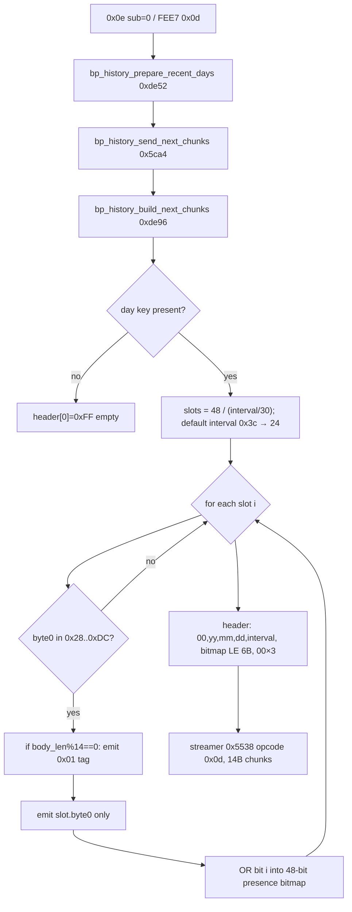

# BP History Persistent 4-Byte Slot Encoding

Firmware: `firmwares/_re/v14/body.bin`  
Base: flash `0x00826400` (body offset = flash − `0x00826400`)

Related: `firmwares/_re/bp-history/evidence.md` (wire `0x0e`/`0x0d` reader only).

## Summary

| Claim | Confidence |
|---|---|
| Sole persistent slot writer is `FUN_0083412c` (body `0xdd2c`) | **High** — only BL target site is body `0xddbe` |
| Slot is 4 bytes: `[compact, 0x00, 0x00, 0x00]` on every write | **High** — writer zero-fills word, then `strb` byte0; length always 4 |
| Compact byte source is `heart_rate_current_bpm()` (ticks 15–20) | **High** — decompile + asm of timer callback |
| Fallback compact = `(prng_next31() % 5) + 0x46` (70–74) when tick ≥ 21 | **High** — exact `/5 + 0x46` path, **only** as timeout fallback |
| Bytes 1–3 are **not** sys/dia/pulse/flags/BCD under v14 write path | **High** — always written 0; reader never loads them |
| Wire `0x0d` projects only byte0 after `0x01` tag; validity `[0x28,0xdc]` | **High** — reconfirmed builder |
| `FUN_00834092` (entry; mid-addr `0x008340e2`) produces live synthetic sys/dia | **High** |
| `FUN_00834092` outputs are **never** stored into the 4-byte slots | **High** — no call path into writer; only live `0x69`/`0x6a` notify |
| Compact history byte is clinical cuff BP (MAP/sys/dia) | **Rejected** for v14 store path — value is HR bpm or 70–74 PRNG |
| Live `0x69` mode-2/5 sys/dia equals cuff BP | **Low / unproven** — pure synthetic from HR + PRNG; needs cuff capture |

## Slot Layout

Persistent day record (`history_desc_bp_hourly` @ flash `0x00845ae4`, range `0x0087a000..0x0087afff`, stride `0x80`):

| Offset | Size | Field | Encoding | Confidence |
|---:|---:|---|---|---|
| `+0` | 4 | day key | day index (ring key) | High |
| `+4 + hour×4` | 4 | hourly slot | see below | High |

### 4-byte hourly slot

| Byte | Name | v14 write value | Notes |
|---:|---|---|---|
| 0 | `compact` | HR bpm ∈ [1..] or PRNG `70..74` | Valid for emit iff `0x28 ≤ v ≤ 0xdc` (40–220) |
| 1 | (pad) | always `0x00` | Sole writer never sets |
| 2 | (pad) | always `0x00` | Sole writer never sets |
| 3 | (pad) | always `0x00` | Sole writer never sets |

Slot index = `minute_of_day / 60` (integer hour). Writer computes
`offset = hour*4 + 4` into the day record body.

RAM mirror (state `DAT_008344ac` → SRAM `0x20c330`) after store:

| State off | Field |
|---:|---|
| `+4` | current day index (u32) |
| `+8` | current hour (u8) |
| `+9` | live compact value (u8) — also preferred by reader for “today/current hour” |

## Measurement → Slot Encoder

### Auto-measure start — `FUN_00834426` (flash `0x00834426`, body `0xe026`)

Gates:

1. BP enable byte `*DAT_008344b4 != 0`
2. Session state byte2 ≠ 0 and byte0 == 3
3. Sport mode ≠ 1
4. No active health sensor session

Then:

```text
health_post_start_measure_event(4)          ; mask 4 = BP auto path
state[+0xd] = 0                             ; tick counter
timer_create_or_restart_ms(state-4, cb=FUN_00834180, 1000 ms, 1)
```

Timer period encoding at body `0xe05e`: `movs r2, 0x7d; lsls r2, r2, 3` → 1000.

### Timer tick — `FUN_00834180` (flash `0x00834180`, body `0xdd80`)

```c
// pseudocode
tick = ++state[0xd];
if (tick <= 3) return;

if (tick < 0x0f) {                 // 4..14
  if (sensor_busy()) return;       // FUN_00837ac8
  // fall through: abort without store
} else if (tick < 0x15) {          // 15..20
  v = heart_rate_current_bpm();
  if (v == 0) return;              // wait next tick
  store(v);
} else {                           // >= 21
  v = (prng_next31() % 5) + 0x46;  // 70..74
  store(v);
}
timer_stop_and_delete(state-4);
health_post_stop_measure_event(4);
```

### Store — `FUN_0083412c` (flash `0x0083412c`, body `0xdd2c`)

```text
buf32 = 0
buf32.byte0 = compact                  ; r4
hour = minute_of_day / 0x3c
history_ring_upsert_record_body(
  desc=0x00845ae4, state, day_index,
  offset=hour*4+4, src=&buf32, len=4)
state[+9] = compact
state[+8] = hour
state[+4] = day_index
channel_a_send_device_notify(2)
```

### Prior hypothesis re-check: “/5 + 0x46”

**Partially real, wrong scope.**  
`(prng % 5) + 0x46` exists only as the **timeout synthetic** when HR never becomes non-zero by tick 21. It is **not** “sensor average / 5 + 70” and is **not** applied to normal HR samples.

## `FUN_00834092` / mid-address `0x008340e2`

- Function entry: flash `0x00834092` (body `0xdc92`)
- Address `0x008340e2` (body `0xdce2`) is **inside** that function (dia clamp region), not a separate routine

### Two outputs

| Output | Destination | Clamp | Role |
|---|---|---|---|
| `*param_2` | caller buffer + cache `DAT_00834118[0]` | `[0x5a, 0x82]` = 90–130 | synthetic **systolic-like** |
| `*param_3` | caller buffer + cache `DAT_00834118[1]` | `[0x3c, 0x50]` = 60–80 | synthetic **diastolic-like** |

Pipeline:

1. `base = FUN_00833f6e(hr, 0x19)` — HR→base with double scale `0.1` (`0x3fdccccc cccccccd`) and table at `0x00845ab8` (age-ish breakpoints 20..60 + offsets)
2. Clamp base into sys range with `prng%5` noise at edges
3. `dia = ((sys-90)*0x19)/0x32 + (prng%8) + 0x3b`, then clamp

### Callers (live notify only)

| Flash call site | Context |
|---|---|
| `0x0082b42c`, `0x0082b530`, `0x0082b622` | `FUN_0082b298` health timer / `0x69` progress (modes 2, 5, `0x0c`) |
| `0x0082c2ee` | `health_handle_stop_measure` mode `0x0c` pack |

**No path** from these outputs into `FUN_0083412c` / the 4-byte history slots. Manual live BP notify sys/dia and hourly history compact byte are **independent**.

## Wire Projection (`0x0d`)

Reconfirmed in `bp_history_build_next_chunks` (flash `0x00834296`, body `0xde96`):



Text form:

```text
day record:  [key:u32][slot0:4B][slot1:4B]...[slot23:4B]
                  |        |
                  |        +--> byte0 only ──► body after 0x01 tags
                  |
wire header: [00][yy][mm][dd][0x3c][bitmap48 LE][00 00 00]
wire body:   [01][b0][b0]... up to 13 values per 14B frame
```

## Key Addresses

| Symbol / role | Flash | Body |
|---|---|---|
| `history_desc_bp_hourly` | `0x00845ae4` | lit @ `0xe0b0` |
| BP state `DAT_008344ac` | ptr → `0x0020c330` | lit @ `0xe0ac` |
| BP config (enable/interval) | ptr → `0x00208abc` | lit @ `0xe0b4` |
| `FUN_00833f6e` HR→base | `0x00833f6e` | `0xdb6e` |
| `FUN_00834092` live sys/dia | `0x00834092` | `0xdc92` |
| mid-ref `0x008340e2` | inside sys/dia | `0xdce2` |
| `FUN_0083412c` slot store | `0x0083412c` | `0xdd2c` |
| `FUN_00834180` measure tick | `0x00834180` | `0xdd80` |
| `bp_history_build_next_chunks` | `0x00834296` | `0xde96` |
| `bp_history_prepare_recent_days` | `0x00834252` | `0xde52` |
| `bp_history_send_next_chunks` | `0x0082c0a4` | `0x5ca4` |
| streamer | `0x0082b938` | `0x5538` |
| auto-measure start | `0x00834426` | `0xe026` |
| module init | `0x00834478` | `0xe078` |
| tick callback thumb ptr | `0x00834181` | lit @ `0xe0c0` |
| `history_ring_upsert_record_body` | `0x008295c6` | `0x31c6` |

## Commands

```sh
r2 -2 -q -a arm -b 16 -e asm.cpu=cortex -e scr.color=0 \
  firmwares/_re/v14/body.bin

# sole writer
pd 40 @ 0xdd2c
# timer tick / encoder
pd 50 @ 0xdd80
# live sys/dia
pd 60 @ 0xdc92
# auto-measure arm
pd 40 @ 0xe026
# reader emit byte0
pd 40 @ 0xdf56
# only BL to store
# (python BL scan) → 0xddbe only
```

Ghidra:

```text
decompile 0x0083412c
decompile 0x00834180
decompile 0x00834092
decompile 0x00834426
decompile 0x00834296
xrefs to 0x00845ae4
```

## What OpenWatch Can Decode Offline

| Artifact | Offline? |
|---|---|
| `0x0d` header date + interval minutes | Yes |
| 48-bit presence → hour slots (with default `0x3c`) | Yes |
| Compact byte stream order ↔ set bits | Yes |
| Compact value as **stored sample** (raw u8) | Yes — keep as `bp_raw` |
| Compact value as systolic/diastolic/MAP | **No** — firmware does not store those in history |
| Interpretation as HR bpm used as BP-history sample | **Likely yes** for auto path (static), still no cuff truth |
| Bytes 1–3 of persistent slots via host protocol | **No** — never on wire; v14 writer zeros them |
| Live `0x69` sys/dia vs cuff | **Needs live capture** |

## Doc Update Recommendations

### `PROTOCOL.md`

- `BpDataRsp` (`0x0d`): note compact byte is the sole stored sample; v14 writer persists `[v,0,0,0]`; source is HR bpm or PRNG 70–74 on auto-measure timeout — **not** encoded sys/dia.
- §8.5 BP gap: mark persistent 4-byte layout + store path **resolved**; leave cuff correlation / live synthetic sys-dia clinical meaning as remaining capture work.

### `GHIDRA_DECOMPILATION.md` §3.19 / history table

- Document writer `FUN_0083412c` / tick `FUN_00834180` / start `FUN_00834426`.
- Clarify `FUN_00834092` is live-only synthetic sys/dia; not history.
- Update `history_desc_bp_hourly` body layout row: slot = compact u8 + 3 zero pads under v14 store path.

## Open / Capture Still Useful

1. Confirm auto-measure schedule cadence vs `0x0c` window on device (static path found; wall-clock trigger site not fully traced beyond `FUN_00834426` callers).
2. Live-capture `0x69` mode 2/5 sys/dia vs simultaneous cuff — firmware is synthetic from HR.
3. Confirm whether any factory/`0xa1` path can seed non-zero slot bytes 1–3 (static: no other writer xrefs to descriptor store).
